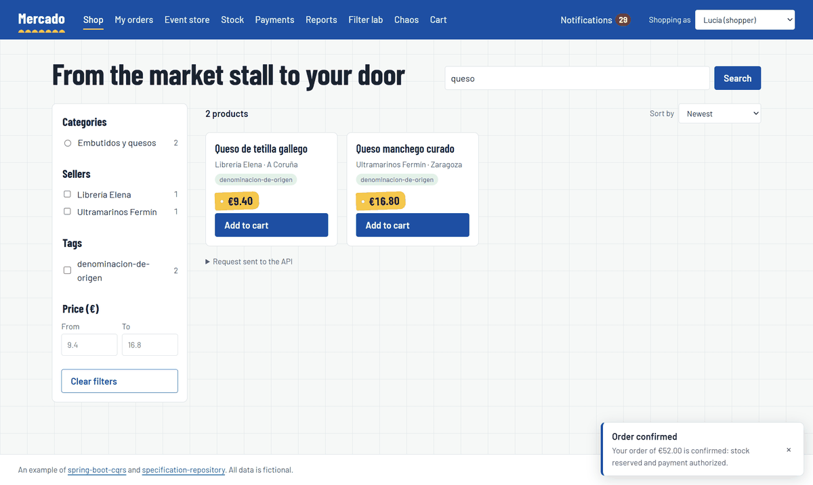
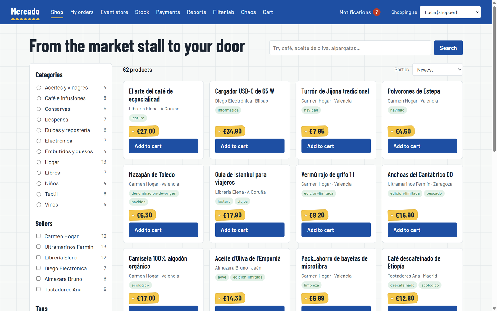
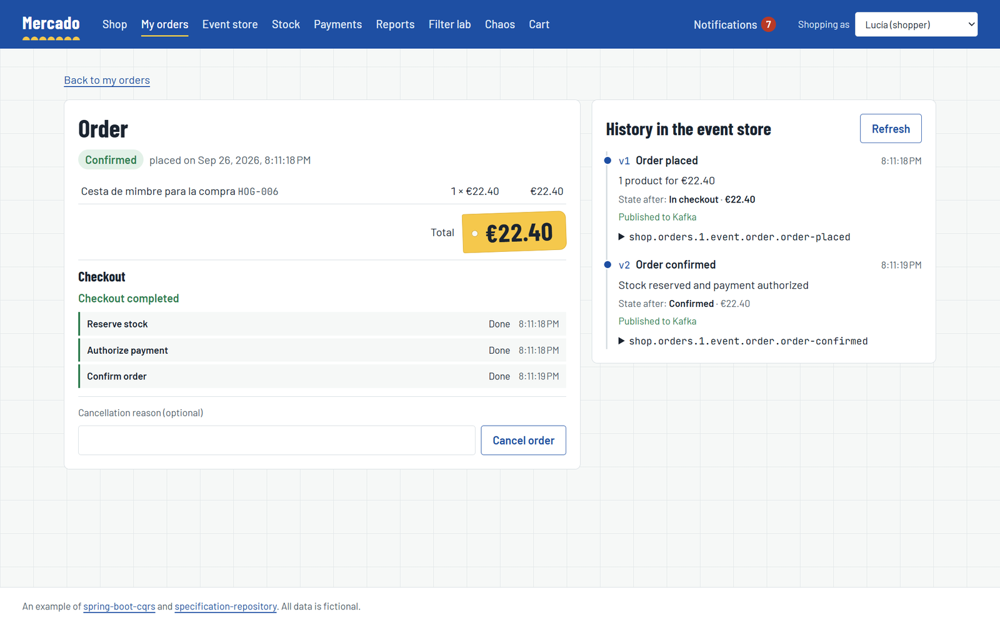
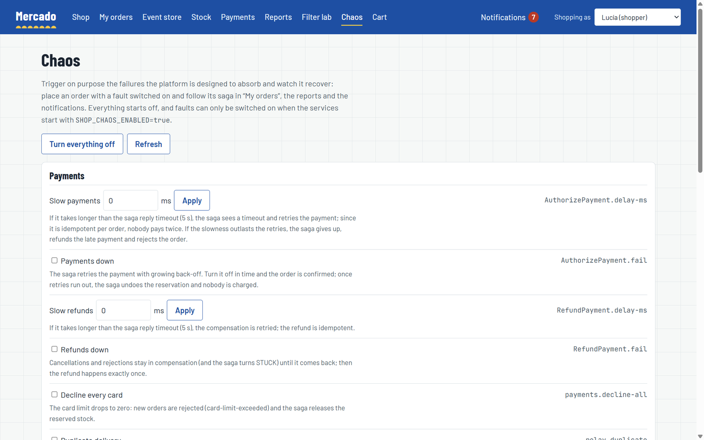

<h1 align="center">Mercado · referencia de microservicios con Spring Boot</h1>

<p align="center">
  Un marketplace completo hecho con microservicios Spring Boot: CQRS, event sourcing, outbox
  transaccional, una saga orquestada, Kafka, RabbitMQ, PostgreSQL, OpenTelemetry, Kubernetes y GraalVM.
  <br>
  El ejemplo de referencia de <a href="https://github.com/borja-glez/spring-boot-cqrs"><b>spring-boot-cqrs</b></a>
  y <a href="https://github.com/borja-glez/spring-boot-specification-repository"><b>spring-boot-specification-repository</b></a>.
</p>

<p align="center">
  <a href="README.md">Read in English</a> ·
  <a href="#arranque-rápido">Arranque rápido</a> ·
  <a href="#arquitectura">Arquitectura</a> ·
  <a href="#observabilidad">Observabilidad</a> ·
  <a href="#documentación">Documentación</a>
</p>

<p align="center">
  <a href="https://github.com/borja-glez/spring-boot-shop-microservices-architecture-example/actions/workflows/ci.yml"></a>
  
  
  
  
  
  
  
  <a href="LICENSE"></a>
</p>

<p align="center">
  
</p>

## Las dos librerías

Mercado existe para mostrar, en un sistema con piezas reales en movimiento, cómo encajan dos librerías
open source en una arquitectura de microservicios con Spring Boot. Todos los comandos, queries y eventos
de la plataforma pasan por la primera; todas las lecturas de base de datos, por la segunda.

<table>
<tr>
<td width="50%" valign="top">

### [spring-boot-cqrs](https://github.com/borja-glez/spring-boot-cqrs)

Buses de comandos, queries y eventos para Spring Boot 3 y 4, con un pipeline de middleware y
transportes intercambiables.

- `CommandBus`, `QueryBus` y `EventBus` con handlers descubiertos por anotaciones.
- Middleware de validación, propagación de contexto (correlation id) y observaciones de Micrometer.
- **RabbitMQ** petición/respuesta para comandos y **Kafka** para eventos, sin cambiar el código.
- Endpoint de Actuator, hints para imágenes nativas GraalVM, starters para Boot 3 y Boot 4.

En Mercado: los controladores solo despachan comandos y queries, la saga de checkout habla con
inventario y pagos por RabbitMQ, y los eventos de integración viajan por Kafka.

```kotlin
implementation("com.borjaglez.cqrs:spring-boot-cqrs-boot4-starter:0.3.1")
implementation("com.borjaglez.cqrs:spring-boot-cqrs-rabbitmq:0.3.1")
implementation("com.borjaglez.cqrs:spring-boot-cqrs-kafka:0.3.1")
```

</td>
<td width="50%" valign="top">

### [spring-boot-specification-repository](https://github.com/borja-glez/spring-boot-specification-repository)

Una DSL de consultas fluida y con tipos para Spring Data JPA, con una sintaxis de filtros HTTP protegida
por listas blancas de campos.

- `repository.query().where(...).leftFetch(...).findOne()` en lugar de métodos derivados o `@Query`.
- `?filter=price.amount:between:5|20&orFilter=...&sort=...` convertido en un `QueryPlan` inmutable.
- Listas blancas de campos filtrables y ordenables por endpoint.
- Agrupaciones y agregados (`COUNT DISTINCT`, `HAVING`) para facetas e informes.

En Mercado: la búsqueda del catálogo, las facetas, «mis pedidos», el explorador del event store, el
backoffice y todos los informes son consultas de specification-repository combinadas con condiciones
del servidor.

```kotlin
implementation("com.borjaglez.specrepository:specification-repository-boot4-starter:0.3.1")
implementation("com.borjaglez.specrepository:specification-repository-http:0.3.1")
```

</td>
</tr>
</table>

<p align="center">
  
</p>

Consulta [cómo se integran las librerías](docs/es/libraries.md) para ver el código detrás de cada caja.

## Qué muestra este ejemplo

| Área | Práctica | Dónde mirar |
|---|---|---|
| **Diseño de servicios** | Base de datos por servicio, capas hexagonales verificadas con ArchUnit, errores RFC 9457 con códigos estables | [Arquitectura](docs/es/architecture.md) |
| **CQRS** | Los controladores despachan comandos y queries; modelos de escritura y de lectura separados | [Librerías](docs/es/libraries.md) |
| **Event sourcing** | Pedidos y pagos guardados como streams de eventos con concurrencia optimista; historia completa de cada pedido | [Event sourcing y outbox](docs/es/event-sourcing-and-outbox.md) |
| **Mensajería fiable** | Outbox transaccional (el propio event store), relay con `SKIP LOCKED`, entrega al menos una vez, consumidores idempotentes | [Event sourcing y outbox](docs/es/event-sourcing-and-outbox.md) |
| **Transacciones distribuidas** | Saga de checkout orquestada y persistida sobre RabbitMQ, con reintentos, backoff y compensaciones | [Saga de checkout](docs/es/checkout-saga.md) |
| **Modelos de lectura** | Proyecciones que toleran eventos desordenados, informes reconstruidos releyendo Kafka desde el offset 0, avisos en vivo por SSE | [Modelos de lectura](docs/es/read-models.md) |
| **Consultas** | Filtros HTTP, listas blancas, condiciones del servidor, facetas e informes agregados | [Consultas](docs/es/querying.md) |
| **Observabilidad** | Una traza por pedido a través de HTTP, RabbitMQ, Kafka, outbox y saga; métricas RED y de negocio; logs enlazados a trazas; dashboards y alertas | [Observabilidad](docs/es/observability.md) |
| **Resiliencia** | Timeouts, idempotencia, compensaciones que nunca se rinden y un panel de caos para romper cosas a propósito | [Resiliencia y escalado](docs/es/resilience-and-scaling.md) |
| **Escalabilidad** | Servicios sin estado, runners de la saga y relays del outbox que se reparten el trabajo entre réplicas, PDB y HPA | [Resiliencia y escalado](docs/es/resilience-and-scaling.md) |
| **Entrega** | Docker Compose, Kubernetes con overlays de Kustomize, imágenes Paketo e imágenes nativas GraalVM | [Despliegue](docs/es/deployment.md) |
| **Interoperabilidad** | Un servicio Spring Boot 3.5 / Jackson 2 que consume eventos escritos por servicios Spring Boot 4 / Jackson 3 | [Modelos de lectura](docs/es/read-models.md) |
| **Testing** | Tests unitarios, ArchUnit, integración con Testcontainers, tests entre generaciones, de sistema y de estrés | [Testing](docs/es/testing.md) |

## Arranque rápido

**Requisitos:** JDK 21 y Docker (Docker Desktop con unos 8 GB de memoria). Nada más: el frontend se
construye dentro de Docker y las librerías vienen de Maven Central.

```bash
git clone https://github.com/borja-glez/spring-boot-shop-microservices-architecture-example.git
cd spring-boot-shop-microservices-architecture-example

./gradlew buildImages          # construye las siete imágenes de los servicios con buildpacks de Paketo
docker compose -f deploy/compose/compose.yaml \
               -f deploy/compose/compose.observability.yaml up -d --build
```

La primera vez descarga las imágenes base y tarda unos minutos. Después abre:

| URL | Qué es |
|---|---|
| <http://localhost:4200> | **La tienda**: catálogo, carrito, pedidos con la saga en vivo, avisos, backoffice, laboratorio de filtros, panel de caos |
| <http://localhost:3000> | **Grafana**: *Dashboards > Shop*, trazas en Tempo, logs en Loki, reglas de alerta |
| <http://localhost:8080/api/catalog/products> | La API pública, a través del gateway |
| <http://localhost:15672> | Consola de RabbitMQ (`shop` / `shop-dev`) |
| <http://localhost:8090> | Kafka UI: el topic `shop.events` |

Para pararlo todo: `docker compose -f deploy/compose/compose.yaml -f deploy/compose/compose.observability.yaml down`
(con `-v` se borran también los datos). Kubernetes, imágenes nativas y desarrollo local están en
[Despliegue](docs/es/deployment.md).

<p align="center">
  
</p>

## Una visita guiada

La interfaz está en inglés. Elige un usuario en la cabecera (clientes como `cliente-lucia` hacen
pedidos; vendedores como `seller-ana` son dueños de productos) y:

1. **Compra algo.** Añade productos al carrito y confirma. La página del pedido sigue la saga paso a paso
   (reservar stock, autorizar el pago, confirmar) y muestra el stream de eventos del pedido, cada evento
   marcado como publicado o pendiente en el outbox. La campana recibe el aviso por SSE.
2. **Provoca un rechazo.** Los pedidos de más de 300 € superan el límite de la tarjeta de la demo: la
   saga libera el stock y rechaza el pedido con el motivo. Baja el stock de un producto en *Stock* y pide
   más de lo que queda para ver un rechazo por falta de stock.
3. **Cancela.** Cancela un pedido confirmado: la saga devuelve el pago y libera el stock (*Payments* lo
   muestra como devuelto).
4. **Rompe cosas.** En *Chaos*, tumba pagos o hazlos lentos, pausa el relay del outbox («Kafka caído»)
   o duplica cada evento. Los checkouts reintentan y se recuperan; informes y avisos se congelan y se
   ponen al día en orden; los duplicados se ignoran.
5. **Reconstruye un modelo de lectura.** En *Reports*, «Rebuild from Kafka» vacía las proyecciones de
   reporting y relee el topic desde el primer evento.
6. **Aprende la sintaxis de consulta.** El *Filter lab* lanza consultas de ejemplo contra el catálogo y
   enseña los resultados y los problemas RFC 9457 que devuelven los filtros inválidos.
7. **Sigue el pedido en Grafana.** Abre *Shop · Checkout saga & messaging* y salta de una línea de log a
   su traza: un pedido es una traza, desde la petición del navegador hasta el último consumidor de Kafka.

| Catálogo con facetas | Página del pedido: saga y stream de eventos |
|---|---|
|  |  |
| **Panel de caos** | **Informes reconstruidos desde Kafka** |
|  |  |

## Arquitectura

| Servicio | Puerto | Responsable de | Se comunica por | Stack |
|---|---|---|---|---|
| `gateway-service` | 8080 | enrutado, correlation id, inicio de las trazas | HTTP | Boot 4, Spring Cloud Gateway |
| `catalog-service` | 8081 | productos, vendedores, categorías, facetas | publica eventos de producto (outbox → Kafka) | Boot 4 |
| `orders-service` | 8082 | pedidos con event sourcing, saga de checkout, modelo de lectura de pedidos | comandos por RabbitMQ a inventario y pagos; eventos de pedido a Kafka; consume eventos de producto y de pedido | Boot 4 |
| `inventory-service` | 8083 | stock y reservas todo o nada | responde `ReserveStock`/`ReleaseStock`; eventos de stock a Kafka | Boot 4 |
| `payments-service` | 8084 | pagos con event sourcing, devoluciones, límite de tarjeta | responde `AuthorizePayment`/`RefundPayment`; eventos de pago a Kafka | Boot 4 |
| `notifications-service` | 8085 | avisos por cliente, stream SSE en vivo | consume eventos de pedido y de pago | **Boot 3.5**, Jackson 2 |
| `reporting-service` | 8086 | informes de ventas, productos, rechazos y clientes | consume eventos de pedido; se reconstruye releyendo Kafka | Boot 4 |
| `frontend` | 4200 | SPA Angular 22 servida por nginx | redirige `/api` al gateway | Angular, nginx |

Tres estilos de comunicación, cada uno donde encaja:

- **HTTP** desde el navegador, a través del gateway, para queries y comandos del usuario.
- **RabbitMQ petición/respuesta** para los comandos de la saga: punto a punto, con respuesta, idempotentes
  por pedido.
- **Kafka** para los eventos de integración: publicados a través del outbox, releíbles y consumidos por
  proyecciones idempotentes.

<table>
<tr>
<td width="50%"></td>
<td width="50%"></td>
</tr>
<tr>
<td align="center"><a href="docs/es/event-sourcing-and-outbox.md">Outbox transaccional y consumidores idempotentes</a></td>
<td align="center"><a href="docs/es/checkout-saga.md">Saga de checkout orquestada</a></td>
</tr>
</table>

<p align="center">
  
</p>

## Observabilidad

Con una sola variable, `OTEL_EXPORTER_OTLP_ENDPOINT`, cada servicio exporta **trazas, métricas y logs**
por OTLP al stack LGTM de Grafana (el fichero de observabilidad de Compose y los overlays de Kubernetes
ya la ponen). El contexto de traza se transporta a mano allí donde el trabajo se aplaza, a través del
outbox y de la saga, así que **un pedido es una traza** a través de HTTP, RabbitMQ, Kafka e hilos en
segundo plano, y cada línea de log enlaza con ella.

<p align="center">
  
</p>

Además de las métricas estándar de HTTP, JVM, base de datos y brokers, la plataforma publica las señales
que importan en esta arquitectura: backlog y antigüedad del outbox, retraso hasta Kafka, eventos
aplicados y duplicados ignorados por consumidor, retraso de los modelos de lectura (la ventana de
consistencia eventual), lag de los consumidores de Kafka, resultados del checkout, motivos de rechazo,
duración y sagas atascadas. Se aprovisionan dos dashboards y cinco reglas de alerta.

| Services overview | Checkout saga & messaging |
|---|---|
|  |  |
| **Un pedido, una traza** | **Logs enlazados a trazas** |
|  |  |

Detalles, nombres de métricas y cómo explorarlas: [Observabilidad](docs/es/observability.md).

## Arráncalo a tu manera

| Objetivo | Comando |
|---|---|
| Todo en Docker, con observabilidad | `docker compose -f deploy/compose/compose.yaml -f deploy/compose/compose.observability.yaml up -d --build` |
| Solo la infraestructura, servicios desde el IDE | `docker compose -f deploy/compose/compose.infra.yaml up -d` y después `./gradlew :services:<nombre>:bootRun` |
| Kubernetes (Docker Desktop) | `./gradlew buildImages`, `docker build -t shop/frontend:0.1.0-SNAPSHOT frontend` y después `kubectl apply -k deploy/k8s/overlays/local` |
| Kubernetes, con réplicas y observabilidad | `kubectl apply -k deploy/k8s/overlays/scaled` |
| Imágenes nativas GraalVM | `./gradlew buildImages -Pnative` y después `SHOP_IMAGE_SUFFIX=-native docker compose ...` u `overlays/native` |

<p align="center">
  
</p>

## Estructura del proyecto

```
build-logic/                 plugins de convenciones de Gradle (Java, librerías, servicios Boot 4 y Boot 3)
platform/
  contracts/                 mensajes entre servicios (@CqrsMessage)
  es-kit/                    event store que hace de outbox, relay, consumidores idempotentes, métricas
  service-support/           errores RFC 9457, correlación, usuario actual, QueryPlans, exportación OTLP, caos
  test-support/              Testcontainers de PostgreSQL, Kafka y RabbitMQ, reglas de ArchUnit
services/
  gateway-service/           único punto de entrada público
  catalog-service/           productos, facetas y búsqueda del catálogo
  orders-service/            pedidos con event sourcing, saga de checkout, modelo de lectura de pedidos
  inventory-service/         stock y reservas
  payments-service/          pagos con event sourcing
  notifications-service/     avisos en vivo (Spring Boot 3.5, Jackson 2, SSE)
  reporting-service/         informes desde sus propias proyecciones, reconstruibles desde Kafka
frontend/                    SPA Angular 22
deploy/compose/              Docker Compose: infraestructura, plataforma, observabilidad
deploy/k8s/                  Kustomize: base, overlays (local, native, observability, scaled), componentes
system-tests/                recorridos y tests de estrés contra una plataforma en marcha
docs/                        documentación en inglés (docs/en) y español (docs/es), diagramas, capturas
```

## Compilar y probar

```bash
./gradlew build                     # compila, Spotless, tests unitarios, ArchUnit y Testcontainers (necesita Docker)
./gradlew :services:orders-service:test --tests "*CheckoutSagaIT"
./gradlew :system-tests:systemTest -Pshop.baseUrl=http://localhost:8080   # contra una plataforma en marcha
cd frontend && npm ci && npm run check                                     # Prettier, ESLint, Vitest y build
```

La estrategia detrás de cada nivel está en [Testing](docs/es/testing.md).

## Documentación

| Guía | Contenido |
|---|---|
| [Arquitectura](docs/es/architecture.md) | Servicios, capas, estilos de comunicación, errores, correlación, valores por defecto comunes |
| [Las librerías en la práctica](docs/es/libraries.md) | Cómo se configuran y se usan spring-boot-cqrs y spring-boot-specification-repository |
| [Event sourcing y outbox](docs/es/event-sourcing-and-outbox.md) | Event store, agregados, relay, garantías de entrega, orden |
| [Saga de checkout](docs/es/checkout-saga.md) | Orquestación, compensaciones, reintentos, idempotencia, escalado del runner |
| [Modelos de lectura](docs/es/read-models.md) | Proyecciones, informes reconstruidos desde Kafka, avisos en vivo |
| [Consultas](docs/es/querying.md) | Sintaxis de filtros HTTP, listas blancas, condiciones del servidor, facetas |
| [Observabilidad](docs/es/observability.md) | Trazas, métricas, logs, dashboards, alertas |
| [Resiliencia y escalado](docs/es/resilience-and-scaling.md) | Modos de fallo, panel de caos, réplicas, imágenes nativas |
| [Despliegue](docs/es/deployment.md) | Compose, Kubernetes, configuración, desarrollo local |
| [Testing](docs/es/testing.md) | Pirámide de tests, Testcontainers, tests de sistema y de estrés |

## Más allá de la demo

Mercado mantiene algunas cosas sencillas a propósito para que la arquitectura sea la protagonista. Un
sistema en producción añadiría autenticación (un resource server OAuth2/OIDC en lugar de la cabecera
`X-Shop-User`), secretos desde un vault o un operador de secretos externo, brokers y bases de datos
replicados, muestreo de trazas basado en cola (tail sampling), enrutado de alertas y TLS en todas partes.
Cada guía indica qué cambia para producción.

## Licencia

[Apache License 2.0](LICENSE).
