# Architecture

Mercado is a marketplace split into six business services and a gateway, each an independent Spring Boot application with its own PostgreSQL database. The browser talks to one origin (nginx serving the Angular shop), nginx forwards `/api/**` to the gateway, and the gateway routes each path prefix to its service. Services never share tables: they cooperate through RabbitMQ request/reply commands (the checkout saga) and through integration events on Kafka, published from a transactional outbox. Inside a service the code follows the same four layers everywhere, enforced by ArchUnit, and a shared platform module gives every service the same error format, correlation ids, current-user resolution and operational defaults.

<p align="center"></p>

## Services

| Service | Port | Responsibility | Database | Messaging in | Messaging out | Spring Boot |
|---|---|---|---|---|---|---|
| `gateway-service` | 8080 | Single public entry point; routes `/api/<service>/**` | none | HTTP from nginx | HTTP to the services | 4 (Jackson 3) |
| `catalog-service` | 8081 | Sellers publish, reprice and discontinue products; public search and facets | `catalog` | Kafka: its own catalog events (logged) | Kafka: `ProductPublished`, `ProductPriceChanged`, `ProductDiscontinued` | 4 (Jackson 3) |
| `orders-service` | 8082 | Event-sourced orders, checkout saga orchestration, local catalog copy, order read model, event store explorer | `orders` | Kafka: catalog events, order events | Kafka: `OrderPlaced`, `OrderConfirmed`, `OrderRejected`, `OrderCancelled`; RabbitMQ requests: `ReserveStock`, `ReleaseStock`, `AuthorizePayment`, `RefundPayment` | 4 (Jackson 3) |
| `inventory-service` | 8083 | Stock per product, all-or-nothing reservations, stock backoffice | `inventory` | RabbitMQ: `ReserveStock`, `ReleaseStock`; Kafka: `ProductPublished` | Kafka: `StockReserved`, `StockReleased`, `StockAdjusted` | 4 (Jackson 3) |
| `payments-service` | 8084 | Event-sourced card payments with a demo card limit, payments backoffice | `payments` | RabbitMQ: `AuthorizePayment`, `RefundPayment` | Kafka: `PaymentAuthorized`, `PaymentDeclined`, `PaymentRefunded` | 4 (Jackson 3) |
| `notifications-service` | 8085 | Customer notices, pushed live over server-sent events | `notifications` | Kafka: order events, `PaymentRefunded` | SSE to the browser | **3.5 (Jackson 2)** |
| `reporting-service` | 8086 | Sales, product, rejection and customer reports from its own projections; rebuild from Kafka | `reporting` | Kafka: order events | none | 4 (Jackson 3) |

`notifications-service` deliberately runs on Spring Boot 3.5 with Jackson 2 while every other service runs on Spring Boot 4 with Jackson 3. It reads the events the Boot 4 services write, which proves that the message contracts and the libraries interoperate across both framework generations. Because of that it depends on neither `service-support`, `es-kit` nor `test-support` (all built against Boot 4), and `platform/contracts` carries no Spring Boot BOM.

## Database per service

A single PostgreSQL instance hosts one database and one owner role per service, created by [`01-databases.sh`](../../deploy/k8s/base/infra/postgres-init/01-databases.sh), the same script for Docker Compose and Kubernetes. The script revokes public access to each database, so a service cannot read another service's data even by accident. Where a service needs data owned by another one it keeps its own copy, fed by events:

| Copy | Owner of the data | Kept by |
|---|---|---|
| `catalog_product` (orders) | catalog | [`CatalogProductProjector`](../../services/orders-service/src/main/java/com/borjaglez/shop/orders/application/projection/CatalogProductProjector.java) |
| `stock_item` rows (inventory) | catalog | [`CatalogProductsProjector`](../../services/inventory-service/src/main/java/com/borjaglez/shop/inventory/application/projection/CatalogProductsProjector.java) |
| `report_order`, `report_line` (reporting) | orders | [`ReportProjector`](../../services/reporting-service/src/main/java/com/borjaglez/shop/reporting/application/projection/ReportProjector.java) |
| `order_owner`, `notification` (notifications) | orders, payments | [`NotificationProjector`](../../services/notifications-service/src/main/java/com/borjaglez/shop/notifications/application/NotificationProjector.java) |

Each schema is managed by Flyway with `ddl-auto: validate`; see [Event sourcing and outbox](event-sourcing-and-outbox.md#flyway-layout) for how service and platform migrations share one history.

## Gateway

The gateway is built on Spring Cloud Gateway Server MVC. Routes are configuration, not code: `shop.gateway.routes[n].{id,path,uri}` in [`application.yaml`](../../services/gateway-service/src/main/resources/application.yaml), validated at startup by [`GatewayRoutesProperties`](../../services/gateway-service/src/main/java/com/borjaglez/shop/gateway/GatewayRoutesProperties.java). [`GatewayRoutesConfiguration`](../../services/gateway-service/src/main/java/com/borjaglez/shop/gateway/GatewayRoutesConfiguration.java) turns each entry into a route and adds three behaviours:

- **Traces start in the platform.** [`ExternalTraceHeadersFilter`](../../services/gateway-service/src/main/java/com/borjaglez/shop/gateway/ExternalTraceHeadersFilter.java) runs before the request is observed and hides `traceparent`, `tracestate` and `baggage` sent by the client. A client can neither join someone else's trace nor switch sampling off for its own orders.
- **One correlation id end to end.** The shared `CorrelationIdFilter` accepts or generates the id, and the route forwards it as `X-Correlation-Id`, so the gateway and the service log the same value. The service's copy of the response header is removed to avoid a duplicate.
- **Unreachable services are 503.** A connection failure becomes an RFC 9457 problem `service-unavailable` instead of an internal error.

## Frontend

The shop is an Angular 22 application ([`frontend/`](../../frontend)) served by an unprivileged nginx. nginx serves the static bundle and proxies `/api/` to `${GATEWAY_URL}` ([`default.conf.template`](../../frontend/nginx/default.conf.template)), so the browser only ever talks to one origin and needs no CORS. Proxy buffering is off and the read timeout is one hour, so server-sent events flow through immediately. During development `ng serve` does the same with [`proxy.conf.json`](../../frontend/proxy.conf.json).

An HTTP interceptor ([`shop-headers.interceptor.ts`](../../frontend/src/app/core/api/shop-headers.interceptor.ts)) adds the demo user (`X-Shop-User`) and a fresh `X-Correlation-Id` to every API call.

## Layers inside a service

Every service uses the package `com.borjaglez.shop.<service>` with four layers:

```
com.borjaglez.shop.<service>
├── domain/          aggregates, value objects, business rules, repository interfaces
├── application/     commands, queries and their handlers, projections, saga
├── infrastructure/  Spring configuration, adapters (RabbitMQ, Kafka, SQL)
└── api/             REST controllers and DTOs
```

[`ShopArchitectureRules`](../../platform/test-support/src/main/java/com/borjaglez/shop/testsupport/architecture/ShopArchitectureRules.java) encodes the rules and each service checks them in its own `ArchitectureTest`:

- `domain` depends on no other layer.
- `application` is used only by `api` and `infrastructure`.
- `api` and `infrastructure` are leaves: nothing depends on them.
- Dependencies are injected through constructors, never with `@Autowired` fields.

Controllers contain no logic: they translate HTTP into a command or a query and send it through the spring-boot-cqrs buses. Repositories live in `domain` and extend `SpecificationRepository`; every read goes through the specification-repository DSL or a `QueryPlan`. See [The libraries in practice](libraries.md).

## Platform modules

| Module | Contents |
|---|---|
| [`platform/contracts`](../../platform/contracts) | Messages exchanged between services (`@CqrsMessage` events, commands and their reply records). Depends only on `spring-boot-cqrs-core`; no Spring or Jackson types, checked by `ContractsConventionsTest`. |
| [`platform/es-kit`](../../platform/es-kit) | Event store that doubles as the transactional outbox, event-sourced aggregate base class, outbox relay, Kafka destination, idempotent consumers, outbox metrics, native-image hints. |
| [`platform/service-support`](../../platform/service-support) | RFC 9457 errors, correlation ids, `@CurrentUser`, `PageResponse`, `QueryPlans`, `TraceCarrier`, OTLP export, chaos registry and endpoint, shared defaults. Auto-configured. |
| [`platform/test-support`](../../platform/test-support) | Testcontainers configurations (PostgreSQL 17, Kafka, RabbitMQ) and the ArchUnit rules. |

Build conventions live in [`build-logic`](../../build-logic/src/main/kotlin): `shop.boot-service-conventions` (Boot 4 services, optional native build), `shop.boot3-service-conventions` (the Boot 3.5 service), `shop.library-conventions`, `shop.java-base-conventions` and `shop.hibernate-enhancement-conventions`.

## Communication styles

| Style | Used for | Why |
|---|---|---|
| HTTP, synchronous | Every call from the UI: queries and user commands (place, cancel, publish, adjust stock) | The user waits for an answer; the gateway gives one origin and one error format. |
| RabbitMQ request/reply | Saga commands from orders to inventory and payments | Directed at one service, needs an answer (reserved or short, authorized or declined), competing consumers share the load. |
| Kafka, via the outbox | Integration events (`Product*`, `Order*`, `Stock*`, `Payment*`) | Any service may subscribe; the log can be replayed (reporting rebuilds from offset 0); publishing is tied to the business transaction. |

Kafka carries events only (`cqrs.kafka.commands.enabled=false`, `cqrs.kafka.queries.enabled=false`). No handler publishes to a broker directly: events are written to the service's `event_store` table in the same transaction as the change and relayed afterwards. See [Event sourcing and outbox](event-sourcing-and-outbox.md) and [Checkout saga](checkout-saga.md).

## Error model

Every Boot 4 service answers errors as RFC 9457 problem details (`application/problem+json`), rendered by [`ProblemDetailsExceptionHandler`](../../platform/service-support/src/main/java/com/borjaglez/shop/support/web/ProblemDetailsExceptionHandler.java):

```json
{
  "type": "https://shop.borjaglez.com/problems/duplicate-sku",
  "title": "Conflict",
  "status": 409,
  "detail": "Another product already uses SKU CAF-001",
  "instance": "/api/catalog/products",
  "code": "duplicate-sku",
  "correlationId": "3f0c9a52-5d1e-4a57-9b43-2f0d5c6b7e11"
}
```

- `code` is a stable kebab-case identifier clients can rely on; `type` is derived from it. `correlationId` lets a user quote the request when reporting a problem. Validation failures add an `errors` array of `{field, message}`.
- Domain code throws [`DomainException`](../../platform/service-support/src/main/java/com/borjaglez/shop/support/error/DomainException.java) subtypes, which carry the code and have no dependency on HTTP: `NotFoundException` (404), `ConflictException` (409) and `BusinessRuleViolationException` (422).
- The handler walks the cause chain (outermost first, up to ten levels) and asks a chain of [`ProblemMapper`](../../platform/service-support/src/main/java/com/borjaglez/shop/support/web/problem/ProblemMapper.java) beans, so wrappers added by the command bus or by Spring Data never hide the real reason:

| Order | Mapper | Maps |
|---|---|---|
| 0 | `DomainProblemMapper` | `DomainException` subtypes to 404 / 409 / 422 |
| 10 | `UserHeaderProblemMapper` | missing `X-Shop-User` to 401 `missing-user`, malformed to 400 `invalid-user` |
| 20 | `DataAccessProblemMapper` | optimistic locking to 409 `concurrent-modification`, integrity violations to 409 `data-integrity-violation` |
| 30 | `ValidationProblemMapper` | Bean Validation failures raised by the command bus to 400 `validation-failed` |
| 40 | `SpecificationQueryProblemMapper` | disallowed fields, unconvertible values and rejected filters to 400 `invalid-filter` |
| 50 | `SpecificationHttpProblemMapper` | malformed `filter` / `orFilter` / `sort` syntax to 400 `invalid-filter` |
| 100 | gateway only | connection failures to 503 `service-unavailable` |

Anything no mapper claims becomes a 500 `internal-error` whose body never contains the exception message. Generic `IllegalArgumentException` or `IllegalStateException` are intentionally not mapped to 4xx: a programming error must look like one. A new exception family is supported by declaring another `ProblemMapper` bean.

`notifications-service` renders the same format, `code` included, with its own [`ProblemHandler`](../../services/notifications-service/src/main/java/com/borjaglez/shop/notifications/api/ProblemHandler.java).

## Correlation ids

[`CorrelationIdFilter`](../../platform/service-support/src/main/java/com/borjaglez/shop/support/web/CorrelationIdFilter.java) gives every request a correlation id. It accepts the incoming `X-Correlation-Id` when it is safe (1 to 64 characters from `[A-Za-z0-9._-]`) and generates a UUID otherwise. The id is:

- echoed in the response header;
- stored as a request attribute, from which problem details read it;
- put in the logging MDC as `correlationId`, printed on every log line and exported with every OTLP log record;
- copied into the spring-boot-cqrs `MessageContext` by `MessageContextCorrelationScope`, so every command and event dispatched while serving the request carries it across RabbitMQ and Kafka. The event store also keeps it in each event's metadata, and the relay restores it when it publishes.

Correlation ids identify a business request; trace ids identify a technical trace. Both appear in the log pattern `[correlationId,traceId]`; see [Observability](observability.md).

## The demo user

The example has no authentication. The shop lets the visitor pick a demo customer or seller and sends its id in the `X-Shop-User` header. Controllers receive it with [`@CurrentUser`](../../platform/service-support/src/main/java/com/borjaglez/shop/support/web/CurrentUser.java):

```java
@PostMapping
@ResponseStatus(HttpStatus.CREATED)
CreatedResponse place(@CurrentUser String customer, @Valid @RequestBody PlaceOrderRequest body) {
```

Ownership is still enforced on the server: customers only see their own orders, and a seller who touches another seller's product gets a 404, so the product's existence is not revealed. `notifications-service` reads the same header, and its SSE stream takes the user as a query parameter because the browser's `EventSource` cannot send headers.

In production the header would be replaced by a real identity: the gateway and the services would run as OAuth2 resource servers validating JWTs issued by an OpenID Connect provider, `@CurrentUser` would resolve the subject from the security context, and operator-only endpoints (event store explorer, payments and stock backoffice, reports, rebuild, chaos) would require an operator role.

## Shared defaults

[`ShopDefaultsEnvironmentPostProcessor`](../../platform/service-support/src/main/java/com/borjaglez/shop/support/autoconfigure/ShopDefaultsEnvironmentPostProcessor.java) registers the settings every Boot 4 service shares, with the lowest precedence, so any `application.yaml`, profile or environment variable can override them:

| Setting | Value | Purpose |
|---|---|---|
| `spring.data.web.pageable.max-page-size` / `default-page-size` | 100 / 20 | No unbounded pages |
| `spring.jpa.open-in-view` | `false` | No lazy loading during view rendering |
| `spring.datasource.hikari.data-source-properties.socketTimeout` | 30 (s) | A query on a dead connection gives up instead of hanging the saga runner or the relay |
| `spring.datasource.hikari.data-source-properties.tcpKeepAlive` | `true` | Idle connections are probed |
| `spring.threads.virtual.enabled` | `true` | Requests and listeners run on virtual threads |
| `server.shutdown` / `spring.lifecycle.timeout-per-shutdown-phase` | `graceful` / 20s | In-flight requests finish on shutdown |
| `management.endpoints.web.exposure.include` | `health,info,prometheus,metrics,cqrs` | Actuator surface, including the spring-boot-cqrs endpoint |
| `management.endpoint.health.probes.enabled`, `show-details` | `true`, `always` | Liveness and readiness groups for Kubernetes |
| `management.info.env.enabled` | `true` | `info.service.description` of each service shows in `/actuator/info` |
| `cqrs.aot.message-packages` | `com.borjaglez.shop.contracts` | Native-image hints for every contract |
| `management.tracing.sampling.probability` | `1.0` | Whole traces in the demo |
| `spring.rabbitmq.*.observation-enabled`, `spring.kafka.*.observation-enabled` | `true` | Trace propagation across both brokers |
| `logging.pattern.correlation` | `[%X{correlationId:-},%X{traceId:-}] ` | Correlation and trace id on every line |

Each service also sets a Hikari `connection-timeout` of 5 seconds and adds `db` to its readiness group, so Kubernetes stops routing traffic to an instance that has lost its database.

## Related

- [The libraries in practice](libraries.md)
- [Event sourcing and outbox](event-sourcing-and-outbox.md)
- [Checkout saga](checkout-saga.md)
- [Read models](read-models.md)
- [Querying](querying.md)
- [Observability](observability.md)
- [Resilience and scaling](resilience-and-scaling.md)
- [Deployment](deployment.md)
- [Testing](testing.md)
