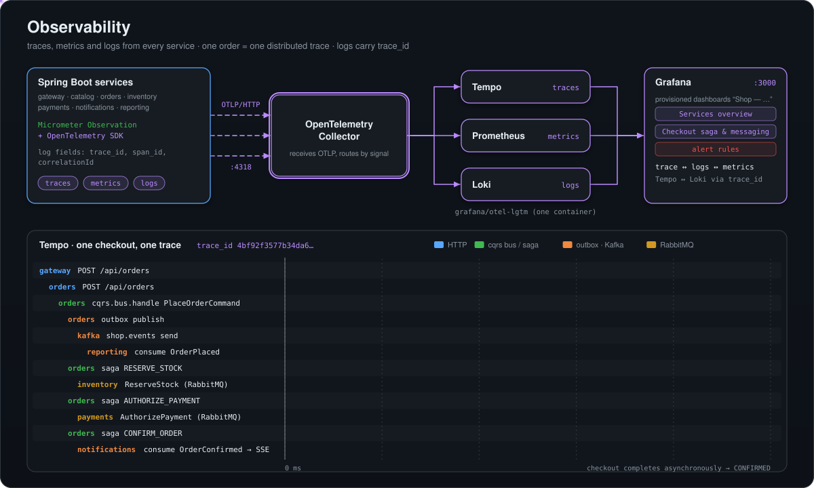
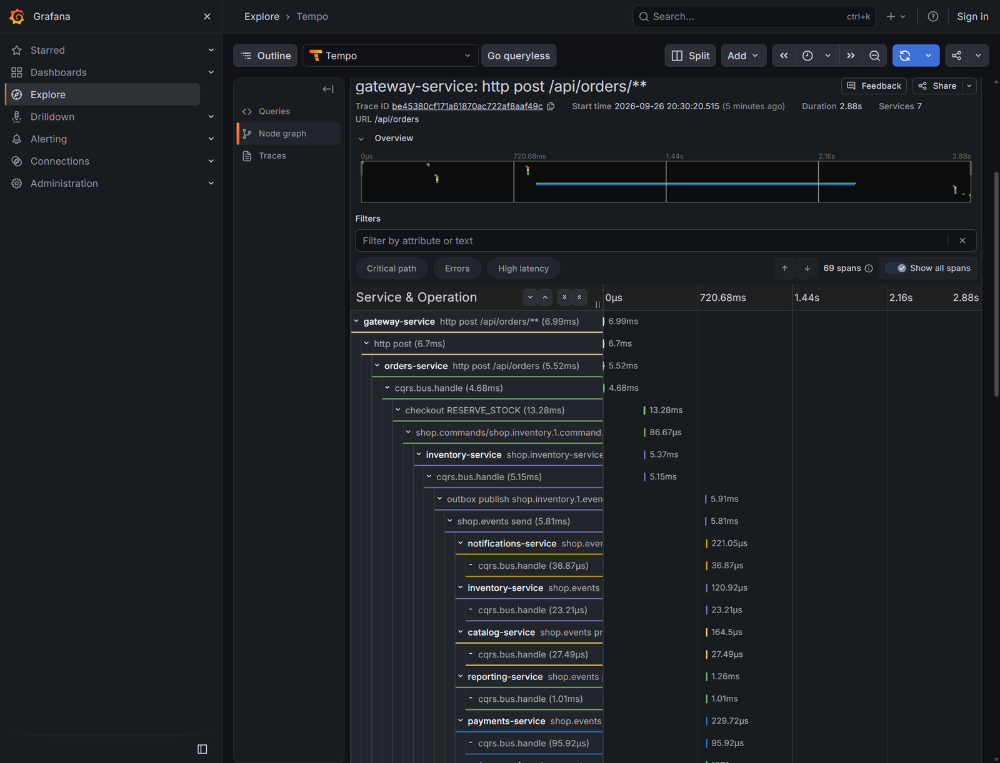
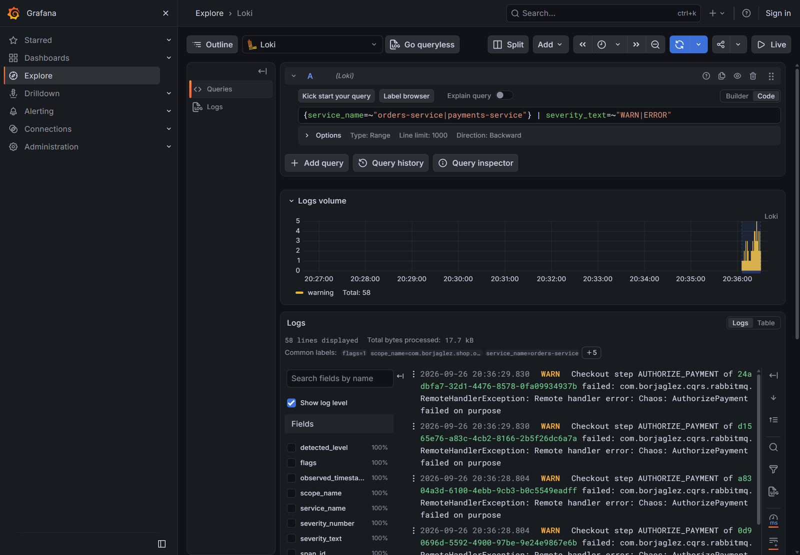
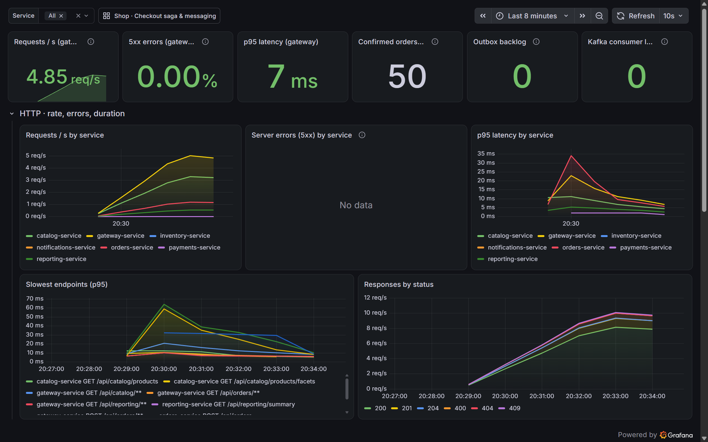
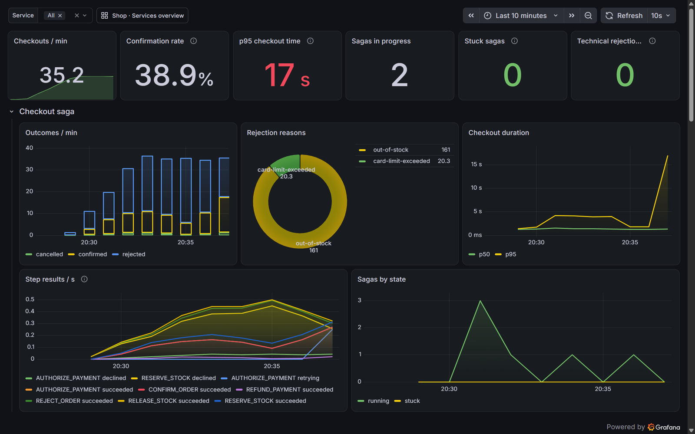

# Observability

Every service of Mercado produces traces, metrics and logs through OpenTelemetry, and a single environment variable, `OTEL_EXPORTER_OTLP_ENDPOINT`, sends all three to an OTLP collector. The demo stack is `grafana/otel-lgtm`: an OpenTelemetry Collector feeding Tempo (traces), Prometheus (metrics) and Loki (logs), with Grafana on top and two dashboards and five alert rules provisioned from the repository. One order is one trace, from the HTTP request at the gateway through the saga steps over RabbitMQ and the events relayed to Kafka, down to the last projection. Standard metrics describe HTTP, JVM, connection pools and brokers; custom metrics describe what the architecture is doing: the outbox backlog, the eventual-consistency window of every read model, and the outcome and duration of every checkout. Logs carry the correlation id and the trace id, and Grafana jumps between a log line and its trace.

<p align="center"></p>

## Turning export on

### Boot 4 services

The Boot 4 services depend on `spring-boot-starter-opentelemetry` (tracing through the Micrometer bridge, OTLP metrics) and the OpenTelemetry Logback appender, both added by `shop.boot-service-conventions`. Nothing is exported until the standard variable is set:

```bash
OTEL_EXPORTER_OTLP_ENDPOINT=http://lgtm:4318
```

`service-support` turns that one variable into everything else, and it reads it when the application starts, not when it is built:

| Signal | Component | What it does |
|---|---|---|
| Traces | [`ShopOtlpAutoConfiguration`](../../platform/service-support/src/main/java/com/borjaglez/shop/support/autoconfigure/ShopOtlpAutoConfiguration.java) | Always defines a `SpanExporter`: an OTLP/HTTP exporter to `<endpoint>/v1/traces` when the variable is set, a no-op composite otherwise. |
| Logs | `ShopOtlpAutoConfiguration.Logs` | Defines a `LogRecordExporter` to `<endpoint>/v1/logs` (no-op otherwise) and an [`OtlpLogAppenderInstaller`](../../platform/service-support/src/main/java/com/borjaglez/shop/support/autoconfigure/OtlpLogAppenderInstaller.java). |
| Logs | `OtlpLogAppenderInstaller` | Once the application's `OpenTelemetry` exists, adds the OpenTelemetry appender to the root Logback logger and captures the MDC key `correlationId` as a log attribute. The console output does not change. |
| Metrics | [`OtlpExportEnvironmentPostProcessor`](../../platform/service-support/src/main/java/com/borjaglez/shop/support/autoconfigure/OtlpExportEnvironmentPostProcessor.java) | Sets `management.otlp.metrics.export.url=<endpoint>/v1/metrics` and a 10 s step. Without the variable it switches the OTLP meter registry off, so a service never retries `localhost:4318` in the background. |

The exporters are created at runtime rather than through Spring Boot's own `@Conditional` OTLP properties for one reason: a native image evaluates conditions at build time, so an image built without the variable could never export, whatever its environment says later. With runtime exporters the same image, JVM or native, exports exactly when the variable is present. Boot's own `management.opentelemetry.tracing.export.otlp.endpoint` must not be set as well, or every span and log record would be exported twice. During AOT processing the post-processor leaves the OTLP meter registry enabled so it is compiled into native images; the URL, bound at runtime, decides whether it pushes.

### notifications-service (Boot 3.5)

Spring Boot 3.5 has no OpenTelemetry starter, so `shop.boot3-service-conventions` adds the Micrometer OTel bridge, the OTLP exporter, the OTLP meter registry and the Logback appender, and the service uses Boot 3's own properties:

```yaml
MANAGEMENT_OTLP_TRACING_ENDPOINT: http://lgtm:4318/v1/traces
MANAGEMENT_OTLP_METRICS_EXPORT_URL: http://lgtm:4318/v1/metrics
MANAGEMENT_OTLP_METRICS_EXPORT_ENABLED: "true"
MANAGEMENT_OTLP_LOGGING_ENDPOINT: http://lgtm:4318/v1/logs
```

Its [`ObservabilityConfiguration`](../../services/notifications-service/src/main/java/com/borjaglez/shop/notifications/infrastructure/ObservabilityConfiguration.java) installs the OTLP log appender when `management.otlp.logging.endpoint` is set, and binds Kafka consumer metrics to the consumers spring-boot-cqrs creates, the same telemetry the Boot 4 services get from the platform modules. Its `application.yaml` samples every request and enables observation on the Kafka listener and template.

The observability Compose file and Kubernetes component set exactly these variables: `OTEL_EXPORTER_OTLP_ENDPOINT` for the six Boot 4 applications and the four `MANAGEMENT_OTLP_*` variables for notifications.

## Traces

### Propagation

- **Sampling.** `management.tracing.sampling.probability=1.0`: every request is traced, because the demo wants whole traces.
- **HTTP.** W3C `traceparent` headers propagate from the gateway to the services.
- **RabbitMQ and Kafka.** `ShopDefaultsEnvironmentPostProcessor` enables observation on the RabbitMQ and Kafka templates and listener containers (`spring.rabbitmq.listener.simple.observation-enabled`, `spring.rabbitmq.template.observation-enabled`, `spring.kafka.listener.observation-enabled`, `spring.kafka.template.observation-enabled`), and the listener containers and templates spring-boot-cqrs builds honour the same observation settings. Trace headers therefore travel with every command, reply and event.
- **Buses.** spring-boot-cqrs wraps every handling in a `cqrs.bus.handle` span tagged with the message kind and type.
- **Deferred work.** Two pieces of work run later, on another thread: the outbox relay publishes an event seconds after the request that recorded it, and the saga runner takes each checkout step long after the order was placed. [`TraceCarrier`](../../platform/service-support/src/main/java/com/borjaglez/shop/support/tracing/TraceCarrier.java) captures the current trace as W3C headers and resumes it later in a new span. The event store keeps the headers in each event's `metadata`, and the relay publishes inside a span named `outbox publish <event type>` that continues it. The saga keeps the `traceparent` in its `trace_parent` column, and every step runs inside a span named `checkout <STEP>`; a cancellation starts the refund in the trace of the cancel request.
- **Traces start in the platform.** The gateway's [`ExternalTraceHeadersFilter`](../../services/gateway-service/src/main/java/com/borjaglez/shop/gateway/ExternalTraceHeadersFilter.java) drops `traceparent`, `tracestate` and `baggage` sent by clients, so nobody can join someone else's trace or switch sampling off for their orders.
- **Health checks are not traced.** An `ObservationPredicate` in [`ShopTracingAutoConfiguration`](../../platform/service-support/src/main/java/com/borjaglez/shop/support/autoconfigure/ShopTracingAutoConfiguration.java) skips server requests under `/actuator`, so Kubernetes probes do not flood Tempo.

### One order, one trace

The spans of a single order, as Tempo shows them (abridged):

```
gateway-service: http post /api/orders/**
  orders-service: http post /api/orders
    orders-service: cqrs.bus.handle                                   (PlaceOrderCommand)
      orders-service: outbox publish ...order-placed                  (relay thread, moments later)
        orders-service: shop.events send -> <every consumer>: shop.events process -> cqrs.bus.handle
      orders-service: checkout RESERVE_STOCK                          (saga runner thread)
        orders-service: RabbitMQ send (ReserveStock)
          inventory-service: RabbitMQ receive -> cqrs.bus.handle
            inventory-service: outbox publish ...stock-reserved -> Kafka -> consumers
      orders-service: checkout AUTHORIZE_PAYMENT -> payments-service ... -> Kafka
      orders-service: checkout CONFIRM_ORDER
        orders-service: outbox publish ...order-confirmed -> Kafka -> reporting-service, notifications-service (Boot 3.5)
```



`CheckoutTracingIT` checks this continuity in the orders service: every step and every event recorded by the saga belong to the trace that placed the order.

## Logs

- **Console.** Every Boot 4 service prints `[correlationId,traceId]` on each line (`logging.pattern.correlation`), so a log line can be matched to both the business request and its trace even without Grafana.
- **OTLP.** With export on, every log line is also sent as an OTLP log record to Loki. The record carries the `trace_id` and `span_id` of the span that wrote it, the severity (`severity_text`), the resource attributes (`service_name`) and, for Boot 4 services, the `correlationId` attribute taken from the MDC.
- **Linked.** Grafana links Loki and Tempo both ways: open a log line to jump to its trace, or open a span to see its logs. The "Latest warnings and errors" panel of the overview dashboard lists recent WARN and ERROR lines with that link.



## Metrics

Metrics are pushed over OTLP every 10 seconds; every service also exposes `/actuator/prometheus` and `/actuator/metrics`. In Prometheus, meter names have their dots replaced by underscores, timers become histograms with a unit suffix (`_milliseconds_bucket`, `_milliseconds_count`, `_milliseconds_sum`), counters get `_total`, and tag names are converted the same way (`event.type` becomes `event_type`). Every series carries the `service_name` label of its service. The shared defaults turn on percentile histograms (`management.metrics.distribution.percentiles-histogram.*`) for `http.server.requests`, `cqrs.bus`, `spring.rabbit` and every `shop.*` timer: without buckets the OTLP registry sends only a count and a sum, and no p95 could be computed. Long-lived server-sent event streams are left out of the latency panels and alerts.

### Standard metrics

| Metric | Source | Prometheus name |
|---|---|---|
| HTTP server requests | Spring Boot | `http_server_requests_milliseconds_*` |
| JVM memory, CPU, threads, GC | Spring Boot / Micrometer | `jvm_memory_used_bytes`, `process_cpu_usage`, ... |
| Connection pools | HikariCP | `hikaricp_connections_active`, `hikaricp_connections_pending`, ... |
| Kafka templates and listeners | Spring Kafka observations | `spring_kafka_template_milliseconds_*`, `spring_kafka_listener_milliseconds_*` |
| RabbitMQ templates and listeners | Spring AMQP observations | `spring_rabbit_template_milliseconds_*`, `spring_rabbit_listener_milliseconds_*` |
| RabbitMQ client | Spring Boot | `rabbitmq_published_total`, `rabbitmq_consumed_total`, ... |
| Bus handling | spring-boot-cqrs `cqrs.bus.handle` | `cqrs_bus_handle_milliseconds_*` (tags `cqrs_message_kind`, `cqrs_message_type`, `error`) |
| Bus dispatch | spring-boot-cqrs `cqrs.bus.dispatch` | `cqrs_bus_dispatch_milliseconds_*` (tags `cqrs_type`, `cqrs_message`, `cqrs_outcome`) |
| Kafka client metrics | Micrometer Kafka binders on every Kafka factory | `kafka_consumer_fetch_manager_records_lag_max`, ... |

Spring Boot instruments only the Kafka factories it creates. [`KafkaClientMetricsPostProcessor`](../../platform/es-kit/src/main/java/com/borjaglez/shop/eskit/kafka/KafkaClientMetricsPostProcessor.java) (es-kit) binds Micrometer's consumer and producer listeners to every `DefaultKafkaConsumerFactory` and `DefaultKafkaProducerFactory` of the service, including the ones spring-boot-cqrs creates for its buses; notifications does the same for its consumers. That is where `kafka.consumer.fetch.manager.records.lag.max`, how many records a consumer and the read models it feeds are behind the log, comes from.

### Custom metrics

| Meter | Prometheus name | Type | Tags | Meaning |
|---|---|---|---|---|
| `shop.outbox.pending` | `shop_outbox_pending` | gauge | | Events stored but not yet published |
| `shop.outbox.oldest.age.seconds` | `shop_outbox_oldest_age_seconds` | gauge | | How long the oldest unpublished event has waited; grows while Kafka or the relay is down, drops to 0 once the backlog is published |
| `shop.outbox.published` | `shop_outbox_published_total` | counter | `event.type` | Events the relay published |
| `shop.outbox.failures` | `shop_outbox_failures_total` | counter | `event.type` | Failed publication attempts |
| `shop.outbox.delay` | `shop_outbox_delay_milliseconds_*` | timer | | From the business transaction to the broker's acknowledgement |
| `shop.consumer.events` | `shop_consumer_events_total` | counter | `consumer`, `outcome` = `applied` / `duplicate` | Events handled by each idempotent consumer |
| `shop.consumer.lag` | `shop_consumer_lag_milliseconds_*` | timer | `consumer` | From the event's time to its projection: the eventual-consistency window of that read model |
| `shop.checkout.steps` | `shop_checkout_steps_total` | counter | `step`, `result` = `succeeded` / `declined` / `retrying` / `gave-up` | Attempts of each saga step |
| `shop.checkout.completed` | `shop_checkout_completed_total` | counter | `outcome` = `confirmed` / `rejected` / `cancelled`, `reason` | Finished sagas and their rejection reason (`none` otherwise) |
| `shop.checkout.duration` | `shop_checkout_duration_milliseconds_*` | timer | `outcome` | From order placed to confirmed or rejected |
| `shop.checkout.sagas` | `shop_checkout_sagas` | gauge | `state` = `running` / `stuck` | Sagas that still have work to do |
| `shop.notifications.sse.connections` | `shop_notifications_sse_connections` | gauge | | Open SSE connections of notifications |

Sources: [`OutboxMetrics`](../../platform/es-kit/src/main/java/com/borjaglez/shop/eskit/OutboxMetrics.java) and [`OutboxRelay`](../../platform/es-kit/src/main/java/com/borjaglez/shop/eskit/OutboxRelay.java) (outbox), [`IdempotentConsumer`](../../platform/es-kit/src/main/java/com/borjaglez/shop/eskit/IdempotentConsumer.java) (consumers), [`CheckoutMetrics`](../../services/orders-service/src/main/java/com/borjaglez/shop/orders/application/checkout/CheckoutMetrics.java) (checkout), [`SseNotificationHub`](../../services/notifications-service/src/main/java/com/borjaglez/shop/notifications/api/SseNotificationHub.java) (SSE). The gauges read the database when they are collected (the pending rows have their own partial index) and report `NaN` instead of failing the collection if the read fails. Counters and timers of the relay and the saga are recorded after their transaction commits, so rolled-back work is never counted.

## Dashboards

Two dashboards are provisioned in the Grafana folder **Shop** from [`deploy/k8s/components/observability/grafana/dashboards`](../../deploy/k8s/components/observability/grafana/dashboards), through the provider [`dashboards.yaml`](../../deploy/k8s/components/observability/grafana/dashboards.yaml). Compose mounts the same files.

### Shop · Services overview (`shop-overview`)

| Row | Panels |
|---|---|
| Summary | Gateway requests/s, gateway 5xx %, gateway p95 latency, confirmed orders in the last hour, outbox backlog, Kafka consumer lag |
| HTTP: rate, errors, duration | Requests/s, 5xx/s and p95 latency per service; slowest endpoints; responses by status (RED per service) |
| Saturation | Memory in use, CPU usage, active and pending database connections per service |
| Logs | WARN and ERROR counts per service from Loki; latest warnings and errors, each line linked to its trace |



### Shop · Checkout saga & messaging (`shop-messaging`)

| Row | Panels |
|---|---|
| Summary | Checkouts per minute, confirmation rate, p95 checkout time, sagas in progress, stuck sagas, technical rejections in the last hour |
| Checkout saga | Outcomes per minute, rejection reasons, checkout duration (p50, p95), step results per second, sagas by state |
| CQRS buses (spring-boot-cqrs) | Handled messages/s by kind and type, handler failures/s, p95 handling time |
| Transactional outbox | Pending events, oldest pending event age, store-to-Kafka delay (p95), published events/s by type, publish failures/s |
| Kafka consumers and read models | Consumer lag in records, read-model delay (p95 of `shop.consumer.lag`), events applied/s, duplicates ignored/s |
| RabbitMQ (saga commands) | Request/reply time (p95), messages published and consumed per second |
| Service graph | Who calls whom over HTTP, RabbitMQ and Kafka, built by Tempo from the spans |

Both dashboards have a `service` variable to focus on one or several services.



## Alert rules

Five rules are provisioned from [`shop-alerts.yaml`](../../deploy/k8s/components/observability/grafana/alerting/shop-alerts.yaml) into the Shop folder (Alerting > Alert rules). Each watches a failure mode the architecture is designed to absorb, so it fires when the safety net has been in use for too long rather than on every transient failure.

| Rule | Condition | Severity | The safety net being used |
|---|---|---|---|
| Server errors above 5% | 5xx share of non-actuator requests per service > 5% for 2 min | critical | Retries and problem details hide single failures; a sustained 5xx rate is a real outage. 4xx are business answers and are not counted. |
| Events are not reaching Kafka | `shop_outbox_oldest_age_seconds` > 60 for 1 min | warning | The outbox keeps every event safe in the database, but read models, reports and notices stop moving until Kafka or the relay is back. |
| Checkout compensations are stuck | `shop_checkout_sagas{state="stuck"}` > 0 for 1 min | critical | A refund or stock release failed 20 times; the saga keeps retrying every 30 s, but money or stock is held meanwhile. |
| Orders rejected because a service did not answer | any `shop_checkout_completed_total{outcome="rejected",reason=~".*-unavailable"}` in 10 min | warning | The saga gave up on inventory or payments after about two minutes of retries; the customer did nothing wrong. |
| Read models are falling behind | `kafka_consumer_fetch_manager_records_lag_max` > 1000 for 5 min | warning | Idempotent consumers absorb redeliveries and lag, but projections are stale; look for failing handlers or scale out. |

The rules have annotations that say where to look next (dashboard, logs, the order page). No contact point is configured: in the demo, firing alerts are visible in Grafana.

## Running it

Docker Compose:

```bash
./gradlew buildImages
docker compose -f deploy/compose/compose.yaml -f deploy/compose/compose.observability.yaml up -d
```

Kubernetes (Docker Desktop), with JVM or native images, or with two replicas of the request path:

```bash
kubectl apply -k deploy/k8s/overlays/observability          # JVM images
kubectl apply -k deploy/k8s/overlays/native-observability   # GraalVM native images
kubectl apply -k deploy/k8s/overlays/scaled                 # 2 replicas + autoscaling + observability
```

Grafana is at http://localhost:3000, with anonymous admin access in the demo. See [Deployment](deployment.md).

## Exploring

- **Dashboards.** Dashboards > Shop. Place a few orders, then turn on faults in the Chaos page and watch the outbox, saga and consumer panels react.
- **Traces.** Explore > Tempo, search by `service.name` (the `spring.application.name` of each service), or with TraceQL, for example all checkout steps of the orders service:

  ```
  {resource.service.name="orders-service" && name=~"checkout.*"}
  ```

- **Logs.** Explore > Loki, for example the warnings of the orders service:

  ```
  {service_name="orders-service"} | severity_text="WARN"
  ```

  Open a line and follow its trace link. The console `[correlationId,traceId]` prefix, the `correlationId` in every problem detail and the `correlationId` attribute in Loki let a support request be followed from the user's error message to the trace.
- **Service graph.** The last row of the messaging dashboard, or Explore > Tempo > Service graph: the gateway, the six services and their HTTP, RabbitMQ and Kafka edges.

## Going to production

The demo favours seeing everything over cost. A production setup would change:

- **Sampling.** Tail-based sampling in the collector (keep every trace with an error or a slow checkout, a fraction of the rest) instead of 100% head sampling.
- **Backends.** A separate OpenTelemetry Collector deployment and dedicated, persistent Tempo, Mimir (or Prometheus) and Loki with retention policies, instead of the all-in-one `otel-lgtm` pod.
- **Alert routing.** Contact points and notification policies (on-call paging for critical rules, chat for warnings), plus runbooks linked from the annotations.
- **SLOs.** Service level objectives on checkout duration and confirmation rate, with burn-rate alerts, built on `shop.checkout.duration` and `shop.checkout.completed`.
- **Exemplars.** Exemplars on the latency histograms to jump from a slow bucket straight to a representative trace.
- **Continuous profiling.** A profiler (for example Grafana Pyroscope) to explain CPU and allocation hot spots behind latency.

## Related

- [Architecture](architecture.md#correlation-ids)
- [Event sourcing and outbox](event-sourcing-and-outbox.md)
- [Checkout saga](checkout-saga.md#metrics)
- [Read models](read-models.md#consistency-window)
- [Resilience and scaling](resilience-and-scaling.md)
- [Deployment](deployment.md)
