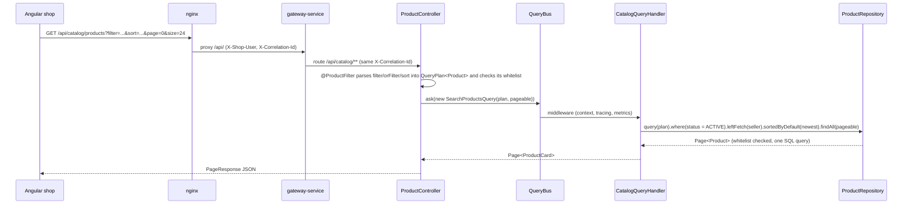

# Querying: catalog search end to end

The public catalog search is the most complete example of how Mercado turns an HTTP request into SQL with spring-boot-specification-repository. The client describes what it wants with repeatable `filter`, `orFilter` and `sort` parameters; `@FilterableQuery` parses them into a `QueryPlan` restricted to a whitelist of fields, with case-insensitive text search; the controller sends the plan on the query bus; and the handler derives it with the conditions the client must not control (only products on sale, the seller fetched in the same query) before running it. Facets reuse the same plan with grouped queries. Invalid input never reaches the database: it is answered with a 400 `invalid-filter` problem. This page follows one request through every step and lists the contract the frontend relies on.

## Request flow



## The HTTP contract

```
GET /api/catalog/products
    ?filter=categories.slug:eq:cafe-e-infusiones      # every filter must match (AND)
    &filter=price.amount:between:5|20                 # lists and ranges separated by |
    &orFilter=name:contains:tueste;tags:eq:ecologico  # one condition of the group is enough (OR)
    &sort=price.amount,asc
    &page=0&size=24
```

| Part | Syntax | Notes |
|---|---|---|
| `filter` | `field:operator[:value]` | Repeatable; all conditions are combined with AND |
| `orFilter` | `cond;cond;...` | Repeatable; each group needs at least one matching condition |
| `sort` | `field,asc` / `field,desc` | Repeatable; only sortable fields |
| `page`, `size` | integers | `size` defaults to 20 and is capped at 100 (`spring.data.web.pageable.*`) |

Each request is bounded before any SQL runs (`specrepository.http.*`, see [The libraries in practice](libraries.md#limits-and-operators)): at most 10 `filter` and `orFilter` conditions, 3 `sort` fields, 50 values in an `in` or `notin` list and 100 characters per value in the catalog. Above them, the answer is a 400 `invalid-filter`.

Operators:

| Operator | Meaning | Value |
|---|---|---|
| `eq`, `neq` | equal, not equal | one |
| `contains`, `notcontains`, `startswith`, `endswith` | text search | one |
| `gt`, `gte`, `lt`, `lte` | comparisons (numbers, dates) | one |
| `between` | inclusive range | two, `from\|to` |
| `in`, `notin` | membership | list, `a\|b\|c` |
| `isnull`, `isnotnull` | null checks | none |
| `isempty`, `isnotempty` | collection has no elements / has some | none |

Dates are ISO-8601 with an offset, because `publishedAt` is an `OffsetDateTime` (`publishedAt:gte:2026-09-01T00:00:00Z`). Nested fields navigate associations (`seller.city`, `categories.slug`) and element collections (`tags`).

The syntax has no escaping: `|` separates list values and `;` separates alternatives, and empty values cannot be expressed. The frontend's [`filter-serializer.ts`](../../frontend/src/app/core/filters/filter-serializer.ts) rejects such values before sending them instead of letting the server split them.

The answer is a [`PageResponse`](../../platform/service-support/src/main/java/com/borjaglez/shop/support/web/PageResponse.java): `content`, `page`, `size`, `totalElements`, `totalPages`.

## Whitelisted fields

[`ProductController`](../../services/catalog-service/src/main/java/com/borjaglez/shop/catalog/api/ProductController.java) declares the fields with [`@ProductFilter`](../../services/catalog-service/src/main/java/com/borjaglez/shop/catalog/api/ProductFilter.java), a composed annotation meta-annotated with `@FilterableQuery` that the search and the facets share:

```java
@FilterableQuery(
    value = Product.class,
    filterableFields = {
      "name", "description", "sku", "price.amount", "status",
      "categories.slug", "tags", "seller.id", "seller.city", "publishedAt"
    },
    caseInsensitiveFields = {"name", "description"})
@interface ProductFilter {

  @AliasFor(annotation = FilterableQuery.class)
  String[] sortableFields() default {};
}
```

```java
@GetMapping
PageResponse<ProductCard> search(
    @ProductFilter(sortableFields = {"name", "sku", "price.amount", "publishedAt"})
        QueryPlan<Product> plan,
    Pageable pageable) {
  Page<ProductCard> page = queries.ask(new SearchProductsQuery(plan, pageable));
  return PageResponse.of(page);
}

@GetMapping("/facets")
CatalogFacets facets(@ProductFilter QueryPlan<Product> plan) {
  return queries.ask(new GetCatalogFacetsQuery(plan));
}
```

`seller.email` exists on the entity but is private: it is in neither list, so it can never be filtered or sorted on, and product views never expose it. The whitelist is checked while the argument is resolved, so a disallowed field is rejected before the controller method runs. The `Pageable` is passed as it is: its sort comes from the same `sort` parameter, and the repository checks it against the same whitelist. Facets declare no sortable fields, so a `sort` on them is rejected too.

Shoppers type "cafe" and expect "Café". The HTTP syntax has no way to ask for case-insensitive matching, so the server decides it for the fields it knows are text: `caseInsensitiveFields` makes `eq`, `neq`, `contains`, `notcontains`, `startswith` and `endswith` on `name` and `description` compare `unaccent(upper(...))` on both sides, which on PostgreSQL ignores case and accents (the catalog's first migration creates the `unaccent` extension). The search term is sent to the database as a bind parameter, so `filter=name:contains:d'oliva` finds "Aceite d'Oliva de l'Empordà" like any other term.

## What the server adds

[`CatalogQueryHandler`](../../services/catalog-service/src/main/java/com/borjaglez/shop/catalog/application/query/CatalogQueryHandler.java) receives the client plan and derives it with `products.query(plan)`:

```java
static final Sort NEWEST_FIRST = Sort.by(Sort.Order.desc("publishedAt"), Sort.Order.asc("id"));

@HandleQuery
@Transactional(readOnly = true, timeout = SEARCH_TIMEOUT_SECONDS) // 5 s
public Page<ProductCard> search(SearchProductsQuery query) {
  return onSale(query.getPlan())
      .leftFetch("seller")
      .sortedByDefault(NEWEST_FIRST)
      .findAll(query.getPageable())
      .map(ProductViews::card);
}

private SpecificationExecutableQuery<Product> onSale(QueryPlan<Product> clientPlan) {
  return products.query(clientPlan).where("status", Operators.EQUALS, ProductStatus.ACTIVE);
}
```

| Step | Why |
|---|---|
| `where(status = ACTIVE)` | The public never sees drafts or discontinued products, even if it filters on `status`. On a derived query it is a server condition: ANDed with the client's filters, not checked against the whitelist, and never widened by an `orFilter`. The client's own filters and sort keep their whitelist. |
| `leftFetch("seller")` | The seller is loaded in the same query (left fetch join), avoiding one query per product. |
| `sortedByDefault(NEWEST_FIRST)` | Without a `sort`, the newest products come first, then by `id`. A sort set on a derived query is the server's: `id` is not a sortable field, but it is not checked against the whitelist, and it keeps products published in the same instant in a stable order across pages. A client `sort=id,asc` is still a 400. |
| `timeout = 5` | The transaction timeout bounds every query of the search: a filter combination the indexes do not cover cannot hold a connection for long. |

## Facets

`GET /api/catalog/products/facets` accepts the same filters and answers how many products on sale match per category, per seller and per tag, plus the price range (shape of the answer; values are illustrative):

```json
{
  "categories": [{ "value": "vinos", "label": "Vinos", "count": 7 }],
  "sellers":    [{ "value": "seller-bruno", "label": "Almazara Bruno", "count": 5 }],
  "tags":       [{ "value": "ecologico", "label": "ecologico", "count": 9 }],
  "price":      { "min": 3.20, "max": 64.00 }
}
```

Each facet is a grouped query over the products on sale, read with `findRows()`, counting distinct products (`countDistinctAs("total", "id")`, because joining categories or tags multiplies rows); the price range reads one row of `minAs`/`maxAs` of `price.amount` with `findRow()`. Values are sorted by count and limited to 20 per facet.

Faceting is **disjunctive**: each facet ignores the client's own filter on its field, so a shopper who selected one seller still sees the other sellers with their counts and can add them. A derived query can add conditions but not remove the client's, so [`QueryPlans.without(plan, field)`](../../platform/service-support/src/main/java/com/borjaglez/shop/support/query/QueryPlans.java) removes the top-level conditions on that field before grouping; alternative groups (`orFilter`) are kept whole.

```java
return new CatalogFacets(
    countBy(onSale(QueryPlans.without(client, "categories.slug")), "categories.slug", "categories.name"),
    countBy(onSale(QueryPlans.without(client, "seller.id")), "seller.id", "seller.displayName"),
    countBy(onSale(QueryPlans.without(client, "tags")), "tags", null),
    priceRange(onSale(QueryPlans.without(client, "price.amount"))));
```

```java
private static List<FacetValue> countBy(
    SpecificationExecutableQuery<Product> query, String valueField, String labelField) {
  String[] groupBy =
      labelField == null ? new String[] {valueField} : new String[] {valueField, labelField};
  List<GroupedRow> rows =
      query.groupBy(groupBy).select(groupBy).countDistinctAs("total", "id").findRows();
  ...
}
```

`GET /api/catalog/categories` uses the same grouping to return every category with its number of active products.


## Invalid filters

Every rejected filter is a 400 RFC 9457 problem with code `invalid-filter`; no rows are read.

| Request | Detected by | Problem detail |
|---|---|---|
| `filter=seller.email:startswith:ana` | whitelist, while resolving the argument (`DisallowedFieldException`) | `Field 'seller.email' is not allowed for filtering` |
| `sort=seller.email,asc` | whitelist | `Field 'seller.email' is not allowed for sorting` |
| `filter=price.amount:gte:abc` | value conversion (`InvalidFilterValueException`) | `Invalid filter on field 'price.amount': cannot convert 'abc' to BigDecimal` |
| `filter=name:like:cafe` | HTTP parser, operator outside `allowed-operators` (`HttpUnknownOperatorException`) | `Unknown filter operator 'like'` |
| `filter=seller.id:in:` with 51 sellers | HTTP parser, `max-values-per-filter` (`HttpFilterSyntaxException`) | `Invalid filter expression 'seller.id:in': too many values (max 50) for field 'seller.id'` |
| `filter=name:contains:` with 101 characters | HTTP parser, `max-value-length` | `... value too long (max 100 characters) for field 'name'` (the value is not echoed) |
| malformed parameter | HTTP parser (`HttpFilterSyntaxException`) | the parser's message |

```json
{
  "type": "https://shop.borjaglez.com/problems/invalid-filter",
  "title": "Bad Request",
  "status": 400,
  "detail": "Field 'seller.email' is not allowed for filtering",
  "instance": "/api/catalog/products",
  "code": "invalid-filter",
  "field": "seller.email",
  "correlationId": "5b1d0c9e-2f4a-4b7e-8a61-0f3c2d9e7a44"
}
```

[`SpecificationProblemMapper`](../../platform/service-support/src/main/java/com/borjaglez/shop/support/web/problem/SpecificationProblemMapper.java) in `service-support` produces these answers, for the errors found while parsing (`HttpFilterSyntaxException`, `HttpUnknownOperatorException`), disallowed fields (`DisallowedFieldException`) and filters the query engine rejects when it runs, such as unconvertible values (`InvalidFilterException`). When the exception names a field, the problem carries it in `field`, as the library's own problem details do. Because the handler walks the cause chain, the answer is the same whether the exception is thrown in the controller or inside the query bus. The library's advice for these exceptions is turned off (`specrepository.http.problem-details.enabled=false`) so that every error of the shop has the same shape.

## The Filter Lab

The shop includes a Filter Lab page (`/lab`) to experiment with the syntax against the real API. Conditions and sort orders are built with a form (or the query string is edited by hand), and the page shows the exact query string and the raw answer, problems included. It also offers ready-made requests ([`lab-presets.ts`](../../frontend/src/app/features/lab/lab-presets.ts)), each with an explanation of the expected result:

| Preset | Query string |
|---|---|
| Case- and accent-insensitive text | `filter=name:contains:cafe` |
| Price range, cheapest first | `filter=price.amount:between:5%7C20&sort=price.amount,asc` |
| Several categories | `filter=categories.slug:in:vinos%7Cconservas` |
| Tag in an element collection | `filter=tags:eq:ecologico` |
| Several conditions (AND) | `filter=tags:eq:ecologico&filter=price.amount:lt:10` |
| Alternatives (OR) | `orFilter=name:contains:queso;tags:eq:navidad` |
| Sort by price, descending | `filter=categories.slug:eq:vinos&sort=price.amount,desc` |
| Field of an association | `filter=seller.city:eq:Jaén` |
| Published in the last 30 days | `filter=publishedAt:gte:<date>T00:00:00Z&sort=publishedAt,desc` |
| Field with a value | `filter=publishedAt:isnotnull` |
| Empty collection | `filter=tags:isempty` |
| Field not allowed | `filter=seller.email:startswith:ana` |
| Sort not allowed | `sort=seller.email,asc` |
| Malformed value | `filter=price.amount:gte:abc` |
| Unknown operator | `filter=name:like:cafe` |


The same requests work from the command line through the gateway:

```bash
curl -s 'http://localhost:8080/api/catalog/products?filter=name:contains:cafe&sort=price.amount,asc'
curl -s 'http://localhost:8080/api/catalog/products/facets?filter=tags:eq:ecologico'
curl -s 'http://localhost:8080/api/catalog/products?filter=seller.email:startswith:ana'   # 400 invalid-filter
```

## The same pattern elsewhere

Every list endpoint of the platform follows the catalog's pattern: `@FilterableQuery` with a whitelist (shared through a composed annotation when several endpoints expose the same entity), the `Pageable` passed as it is, and server conditions and default sorts added by deriving the plan with `repository.query(plan)`. The whitelists of all endpoints are listed in [The libraries in practice](libraries.md#http-filters-with-filterablequery).

## Related

- [The libraries in practice](libraries.md)
- [Architecture](architecture.md#error-model)
- [Read models](read-models.md#reports)
- [Event sourcing and outbox](event-sourcing-and-outbox.md#reading-the-store)
