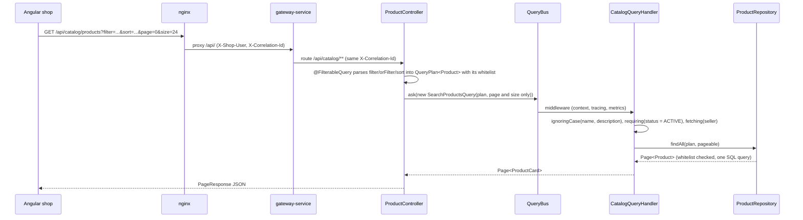

# Querying: catalog search end to end

The public catalog search is the most complete example of how Mercado turns an HTTP request into SQL with spring-boot-specification-repository. The client describes what it wants with repeatable `filter`, `orFilter` and `sort` parameters; `@FilterableQuery` parses them into a `QueryPlan` restricted to a whitelist of fields; the controller sends the plan on the query bus; and the handler composes the conditions the client must not control (only products on sale, case-insensitive text, the seller fetched in the same query) before running it. Facets reuse the same plan with grouped queries. Invalid input never reaches the database: it is answered with a 400 `invalid-filter` problem. This page follows one request through every step and lists the contract the frontend relies on.

## Request flow



## The HTTP contract

```
GET /api/catalog/products
    ?filter=categories.slug:eq:cafe-e-infusiones      # every filter must match (AND)
    &filter=price.amount:between:5|20                 # lists and ranges separated by |
    &orFilter=name:contains:tueste;tags:eq:ecologico  # one condition of the group is enough (OR)
    &sort=price.amount,asc
    &page=0&size=24
```

| Part | Syntax | Notes |
|---|---|---|
| `filter` | `field:operator[:value]` | Repeatable; all conditions are combined with AND |
| `orFilter` | `cond;cond;...` | Repeatable; each group needs at least one matching condition |
| `sort` | `field,asc` / `field,desc` | Repeatable; only sortable fields |
| `page`, `size` | integers | `size` defaults to 20 and is capped at 100 (`spring.data.web.pageable.*`) |

Operators:

| Operator | Meaning | Value |
|---|---|---|
| `eq`, `neq` | equal, not equal | one |
| `contains`, `notcontains`, `startswith`, `endswith` | text search | one |
| `gt`, `gte`, `lt`, `lte` | comparisons (numbers, dates) | one |
| `between` | inclusive range | two, `from\|to` |
| `in`, `notin` | membership | list, `a\|b\|c` |
| `isnull`, `isnotnull` | null checks | none |
| `isempty`, `isnotempty` | collection has no elements / has some | none |

Dates are ISO-8601 with an offset, because `publishedAt` is an `OffsetDateTime` (`publishedAt:gte:2026-09-01T00:00:00Z`). Nested fields navigate associations (`seller.city`, `categories.slug`) and element collections (`tags`).

The syntax has no escaping: `|` separates list values and `;` separates alternatives, and empty values cannot be expressed. The frontend's [`filter-serializer.ts`](../../frontend/src/app/core/filters/filter-serializer.ts) rejects such values before sending them instead of letting the server split them.

The answer is a [`PageResponse`](../../platform/service-support/src/main/java/com/borjaglez/shop/support/web/PageResponse.java): `content`, `page`, `size`, `totalElements`, `totalPages`.

## Whitelisted fields

[`ProductController`](../../services/catalog-service/src/main/java/com/borjaglez/shop/catalog/api/ProductController.java) declares the fields on the parameter:

```java
@FilterableQuery(
        value = Product.class,
        filterableFields = {
          "name", "description", "sku", "price.amount", "status",
          "categories.slug", "tags", "seller.id", "seller.city", "publishedAt"
        },
        sortableFields = {"name", "sku", "price.amount", "publishedAt"})
    QueryPlan<Product> plan
```

`seller.email` exists on the entity but is private: it is in neither list, so it can never be filtered or sorted on, and product views never expose it. The controller keeps only the page number and size of the `Pageable` (`pagingOnly`): the `sort` parameter is also parsed into the plan, where the whitelist validates it, and a `Pageable` sort would bypass that check.

## What the server adds

[`CatalogQueryHandler`](../../services/catalog-service/src/main/java/com/borjaglez/shop/catalog/application/query/CatalogQueryHandler.java) receives the client plan and completes it with [`QueryPlans`](../../platform/service-support/src/main/java/com/borjaglez/shop/support/query/QueryPlans.java):

```java
private static final PredicateCondition ON_SALE =
    new PredicateCondition("status", Operators.EQUALS, ProductStatus.ACTIVE, false, false);
private static final Set<String> TEXT_FIELDS = Set.of("name", "description");

@HandleQuery
@Transactional(readOnly = true)
public Page<ProductCard> search(SearchProductsQuery query) {
  QueryPlan<Product> plan = QueryPlans.fetching(publicPlan(query.getPlan()), "seller");
  return products.findAll(plan, query.getPageable()).map(ProductViews::card);
}

/** Client filters, case-insensitive on text, restricted to products on sale. */
private static QueryPlan<Product> publicPlan(QueryPlan<Product> clientPlan) {
  return QueryPlans.requiring(QueryPlans.ignoringCase(clientPlan, TEXT_FIELDS), ON_SALE);
}
```

| Step | Why |
|---|---|
| `ignoringCase(plan, {name, description})` | Shoppers type "cafe" and expect "Café". The HTTP syntax cannot ask for case-insensitive matching, so the service decides it for the fields it knows are text; `contains`, `notcontains`, `startswith` and `endswith` on them ignore case and accents. |
| `requiring(plan, status = ACTIVE)` | The public never sees drafts or discontinued products, even if it filters on `status`. `requiring` first checks the client's conditions and sort against the whitelist, then adds the server condition. |
| `fetching(plan, "seller")` | The seller is loaded in the same query (left fetch join), avoiding one query per product. |

## Facets

`GET /api/catalog/products/facets` accepts the same filters and answers how many products on sale match per category, per seller and per tag, plus the price range (shape of the answer; values are illustrative):

```json
{
  "categories": [{ "value": "vinos", "label": "Vinos", "count": 7 }],
  "sellers":    [{ "value": "seller-bruno", "label": "Almazara Bruno", "count": 5 }],
  "tags":       [{ "value": "ecologico", "label": "ecologico", "count": 9 }],
  "price":      { "min": 3.20, "max": 64.00 }
}
```

Each facet is a `findAllGrouped` over the public plan, counting distinct products (`COUNT_DISTINCT` of `id`, because joining categories or tags multiplies rows); the price range uses `MIN` and `MAX` of `price.amount`. Values are sorted by count and limited to 20 per facet.

Faceting is **disjunctive**: each facet ignores the client's own filter on its field, so a shopper who selected one seller still sees the other sellers with their counts and can add them. `QueryPlans.without(plan, field)` removes the top-level conditions on that field before grouping; alternative groups (`orFilter`) are kept whole.

```java
return new CatalogFacets(
    countBy(publicPlan(QueryPlans.without(client, "categories.slug")), "categories.slug", "categories.name"),
    countBy(publicPlan(QueryPlans.without(client, "seller.id")), "seller.id", "seller.displayName"),
    countBy(publicPlan(QueryPlans.without(client, "tags")), "tags", null),
    priceRange(publicPlan(QueryPlans.without(client, "price.amount"))));
```

`GET /api/catalog/categories` uses the same grouping to return every category with its number of active products.


## Invalid filters

Every rejected filter is a 400 RFC 9457 problem with code `invalid-filter`; the database is never queried.

| Request | Detected by | Problem detail |
|---|---|---|
| `filter=seller.email:startswith:ana` | whitelist (`DisallowedFieldException`) | `Field 'seller.email' is not allowed for filtering` |
| `sort=seller.email,asc` | whitelist | `Field 'seller.email' is not allowed for sorting` |
| `filter=price.amount:gte:abc` | value conversion (`ConversionFailedException`) | `The value 'abc' is not a valid BigDecimal.` |
| `filter=name:like:cafe` | HTTP parser (`HttpUnknownOperatorException`) | `Unknown filter operator 'like'` |
| malformed parameter | HTTP parser (`HttpFilterSyntaxException`) | the parser's message |

```json
{
  "type": "https://shop.borjaglez.com/problems/invalid-filter",
  "title": "Bad Request",
  "status": 400,
  "detail": "Field 'seller.email' is not allowed for filtering",
  "instance": "/api/catalog/products",
  "code": "invalid-filter",
  "correlationId": "5b1d0c9e-2f4a-4b7e-8a61-0f3c2d9e7a44"
}
```

Two mappers in `service-support` produce these answers: [`SpecificationHttpProblemMapper`](../../platform/service-support/src/main/java/com/borjaglez/shop/support/web/problem/SpecificationHttpProblemMapper.java) for syntax errors found while parsing, and [`SpecificationQueryProblemMapper`](../../platform/service-support/src/main/java/com/borjaglez/shop/support/web/problem/SpecificationQueryProblemMapper.java) for disallowed fields, unconvertible values and filters the query engine rejects when it runs. Because the handler walks the cause chain, the answer is the same whether the exception is thrown in the controller or inside the query bus.

## The Filter Lab

The shop includes a Filter Lab page (`/lab`) to experiment with the syntax against the real API. Conditions and sort orders are built with a form (or the query string is edited by hand), and the page shows the exact query string and the raw answer, problems included. It also offers ready-made requests ([`lab-presets.ts`](../../frontend/src/app/features/lab/lab-presets.ts)), each with an explanation of the expected result:

| Preset | Query string |
|---|---|
| Case- and accent-insensitive text | `filter=name:contains:cafe` |
| Price range, cheapest first | `filter=price.amount:between:5%7C20&sort=price.amount,asc` |
| Several categories | `filter=categories.slug:in:vinos%7Cconservas` |
| Tag in an element collection | `filter=tags:eq:ecologico` |
| Several conditions (AND) | `filter=tags:eq:ecologico&filter=price.amount:lt:10` |
| Alternatives (OR) | `orFilter=name:contains:queso;tags:eq:navidad` |
| Sort by price, descending | `filter=categories.slug:eq:vinos&sort=price.amount,desc` |
| Field of an association | `filter=seller.city:eq:Jaén` |
| Published in the last 30 days | `filter=publishedAt:gte:<date>T00:00:00Z&sort=publishedAt,desc` |
| Field with a value | `filter=publishedAt:isnotnull` |
| Empty collection | `filter=tags:isempty` |
| Field not allowed | `filter=seller.email:startswith:ana` |
| Sort not allowed | `sort=seller.email,asc` |
| Malformed value | `filter=price.amount:gte:abc` |
| Unknown operator | `filter=name:like:cafe` |


The same requests work from the command line through the gateway:

```bash
curl -s 'http://localhost:8080/api/catalog/products?filter=name:contains:cafe&sort=price.amount,asc'
curl -s 'http://localhost:8080/api/catalog/products/facets?filter=tags:eq:ecologico'
curl -s 'http://localhost:8080/api/catalog/products?filter=seller.email:startswith:ana'   # 400 invalid-filter
```

## The same pattern elsewhere

Every list endpoint of the platform follows the catalog's pattern: `@FilterableQuery` with a whitelist, page and size from the `Pageable`, server conditions and defaults composed with `QueryPlans`. The whitelists of all endpoints are listed in [The libraries in practice](libraries.md#http-filters-with-filterablequery).

## Related

- [The libraries in practice](libraries.md)
- [Architecture](architecture.md#error-model)
- [Read models](read-models.md#reports)
- [Event sourcing and outbox](event-sourcing-and-outbox.md#reading-the-store)
