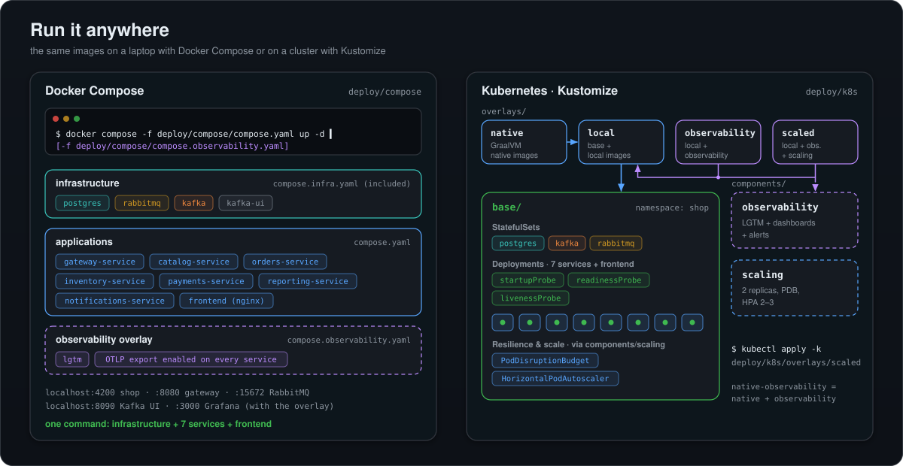

# Despliegue

Mercado ejecuta las mismas imágenes de contenedor de tres formas: la infraestructura en Docker con los servicios arrancados desde Gradle o un IDE para desarrollo, toda la plataforma en Docker Compose, o toda la plataforma en Kubernetes con overlays de Kustomize (basta con el clúster de Docker Desktop). Las imágenes de los servicios se construyen con Cloud Native Buildpacks (Paketo), como imágenes JVM o nativas GraalVM, sin Dockerfiles; el frontend tiene un pequeño Dockerfile multi-stage. Todo ajuste que necesita un despliegue es una variable de entorno con un valor por defecto local, y la observabilidad, la inyección de fallos y el escalado horizontal son capas opcionales que se añaden con un fichero de Compose o un componente de Kustomize.

<p align="center"></p>

## Requisitos previos

| Herramienta | Necesaria para |
|---|---|
| JDK 21 | Compilar y ejecutar los servicios (la toolchain de Gradle lo exige). Usa siempre el wrapper, `./gradlew`. |
| Docker (Docker Desktop en Windows y macOS) | Infraestructura, imágenes, tests basados en Testcontainers |
| Node 24 | Solo para el desarrollo del frontend (`ng serve`, `npm run check`); la imagen del frontend se construye con su propio Node |
| Kubernetes (opcional) | El clúster integrado de Docker Desktop, `kubectl` con soporte de Kustomize |

Las dos librerías vienen de Maven Central; no hace falta ningún otro checkout.

## Docker Compose

Tres ficheros en [`deploy/compose`](../../deploy/compose):

| Fichero | Contenido |
|---|---|
| [`compose.infra.yaml`](../../deploy/compose/compose.infra.yaml) | PostgreSQL 17 (`max_connections=250`, una base de datos por servicio a partir del script de inicialización compartido), RabbitMQ 4.3 con la UI de gestión, Kafka 4.3 en modo KRaft (3 particiones, retención `-1`), Kafka UI |
| [`compose.yaml`](../../deploy/compose/compose.yaml) | Incluye la infraestructura y añade los siete servicios y el frontend, con `depends_on` basado en health checks, un límite de memoria de 768 MiB por servicio y `SHOP_CHAOS_ENABLED=true` |
| [`compose.observability.yaml`](../../deploy/compose/compose.observability.yaml) | Añade `grafana/otel-lgtm` con los dashboards y las reglas de alerta de la tienda, y las variables OTLP de cada servicio |

```bash
./gradlew buildImages                                  # JVM images shop/<service>:0.1.0-SNAPSHOT
docker compose -f deploy/compose/compose.yaml up -d --build
# with traces, metrics, logs, dashboards and alerts:
docker compose -f deploy/compose/compose.yaml -f deploy/compose/compose.observability.yaml up -d
# with native images:
./gradlew buildImages -Pnative
SHOP_IMAGE_SUFFIX=-native docker compose -f deploy/compose/compose.yaml up -d
```

`--build` construye la imagen del frontend a partir de [`frontend/Dockerfile`](../../frontend/Dockerfile). `SHOP_VERSION` y `SHOP_IMAGE_SUFFIX` seleccionan la etiqueta de la imagen; `notifications-service` siempre usa su imagen JVM.

### URLs

| URL | Qué es |
|---|---|
| http://localhost:4200 | La tienda (nginx + Angular) |
| http://localhost:8080 | Gateway, por ejemplo http://localhost:8080/api/catalog/products |
| http://localhost:8081 ... 8086 | catalog, orders, inventory, payments, notifications y reporting directamente (Actuator incluido) |
| http://localhost:15672 | Gestión de RabbitMQ (`shop` / `shop-dev`) |
| http://localhost:8090 | Kafka UI |
| http://localhost:3000 | Grafana (con `compose.observability.yaml`) |
| `localhost:5432`, `localhost:5672`, `localhost:9094` | PostgreSQL, AMQP y Kafka para el desarrollo local |

## Desarrollo local

Ejecuta la infraestructura en Docker y los servicios desde Gradle o un IDE. Todos los servicios usan `localhost` por defecto para PostgreSQL (5432), RabbitMQ (5672) y Kafka (9094, el listener externo del broker). El script de inicialización crea cada rol de base de datos con la contraseña `shop-dev`, así que pásala:

```bash
docker compose -f deploy/compose/compose.infra.yaml up -d
DB_PASSWORD=shop-dev ./gradlew :services:catalog-service:bootRun
DB_PASSWORD=shop-dev ./gradlew :services:orders-service:bootRun
DB_PASSWORD=shop-dev ./gradlew :services:inventory-service:bootRun
DB_PASSWORD=shop-dev ./gradlew :services:payments-service:bootRun
DB_PASSWORD=shop-dev ./gradlew :services:notifications-service:bootRun
DB_PASSWORD=shop-dev ./gradlew :services:reporting-service:bootRun
./gradlew :services:gateway-service:bootRun
cd frontend && npm ci && npm start                     # http://localhost:4200
```

`ng serve` hace de proxy de `/api` hacia el gateway en el puerto 8080 ([`proxy.conf.json`](../../frontend/proxy.conf.json)). Para probar el panel de caos en local, arranca los servicios con `SHOP_CHAOS_ENABLED=true`.

## Kubernetes con Kustomize

Los manifiestos viven en [`deploy/k8s`](../../deploy/k8s), todos en el namespace `shop`:

```
deploy/k8s/
├── base/
│   ├── infra/        postgres, rabbitmq, kafka (StatefulSets with PVCs), kafka-ui, postgres-init ConfigMap
│   ├── apps/         one Deployment + Service per service, and the frontend
│   └── kustomization.yaml   namespace, labels, shop-credentials secret generator
├── components/
│   ├── observability/   otel-lgtm, Grafana provisioning (dashboards, alerts), OTLP env vars
│   └── scaling/         2 replicas, rolling-update strategy, PDBs, HPAs, topology spread
└── overlays/
    ├── local/                  base + local image tags, LoadBalancer for gateway and frontend,
    │                           imagePullPolicy IfNotPresent, SHOP_CHAOS_ENABLED=true
    ├── native/                 local + native image tags, smaller resources, shorter startup probe
    ├── observability/          local + observability component
    ├── native-observability/   native + observability component
    └── scaled/                 local + observability + scaling components
```

```bash
./gradlew buildImages                                   # or -Pnative for the native overlays
docker build -t shop/frontend:0.1.0-SNAPSHOT frontend
kubectl apply -k deploy/k8s/overlays/local              # or native, observability, native-observability, scaled
kubectl -n shop rollout status deploy/catalog-service deploy/orders-service deploy/inventory-service \
  deploy/payments-service deploy/notifications-service deploy/reporting-service deploy/gateway-service
```

Docker Desktop publica los servicios `LoadBalancer` en localhost: la tienda en http://localhost:4200, el gateway en http://localhost:8080 y, con el componente de observabilidad, Grafana en http://localhost:3000. Las imágenes se llaman `shop/<service>:0.1.0-SNAPSHOT` (JVM) y `shop/<service>:0.1.0-SNAPSHOT-native` (nativa), y se toman del daemon de Docker local.

Todos los Deployments de los servicios se ejecutan sin root con un perfil seccomp `RuntimeDefault`, eliminan todas las capabilities y tienen probes de startup, readiness (con base de datos) y liveness, un `preStop` con sleep y un periodo de gracia de terminación de 40 s. Consulta [Resiliencia y escalado](resilience-and-scaling.md#apagado-ordenado-y-probes).

**Secretos.** La base genera `shop-credentials` (`postgres-password`, `db-password`, `rabbitmq-password`) con valores de desarrollo. Un entorno real sustituye ese generador en su propio overlay o usa un operador de secretos externo; los secretos de producción nunca se suben al repositorio.

La CI renderiza cada overlay con `kubectl kustomize` y valida los ficheros de Compose con `docker compose config`.

## Imágenes

| Imagen | La construye | Notas |
|---|---|---|
| `shop/<service>:0.1.0-SNAPSHOT` | `./gradlew buildImages` (`bootBuildImage` de cada servicio, de uno en uno) | Buildpacks de Paketo, Java 21, sin root |
| `shop/<service>:0.1.0-SNAPSHOT-native` | `./gradlew buildImages -Pnative` | GraalVM 25 dentro de Paketo; no para `notifications-service` |
| `shop/frontend:0.1.0-SNAPSHOT` | `docker build -t shop/frontend:0.1.0-SNAPSHOT frontend` o `docker compose ... --build` | Etapa de build con Node 24, `nginx-unprivileged` en el puerto 8080 |

Las peticiones se ejecutan en hilos virtuales, así que los manifiestos y Compose fijan `BPL_JVM_THREAD_COUNT=50`: la calculadora de memoria de Paketo reserva entonces espacio de pila para 50 hilos de plataforma en lugar de sus 250 por defecto, lo que deja más heap dentro del límite de 768 MiB.

## Configuración

Cada servicio lee sus ajustes de variables de entorno con valores por defecto locales en su `application.yaml`.

| Variable | Por defecto | La usa |
|---|---|---|
| `DB_HOST`, `DB_PORT` | `localhost`, `5432` | servicios con base de datos |
| `DB_NAME`, `DB_USER` | el nombre del servicio (`catalog`, `orders`...) | servicios con base de datos |
| `DB_PASSWORD` | el nombre del servicio (`shop-dev` en Compose y Kubernetes) | servicios con base de datos |
| `DB_POOL_SIZE` | `10` | servicios con base de datos |
| `KAFKA_BOOTSTRAP` | `localhost:9094` | todos los servicios salvo el gateway |
| `RABBIT_HOST`, `RABBIT_PORT`, `RABBIT_USER`, `RABBIT_PASSWORD` | `localhost`, `5672`, `shop`, `shop-dev` | orders, inventory, payments |
| `SERVER_PORT` | 8080 ... 8086 | todos los servicios |
| `CATALOG_URI`, `ORDERS_URI`, `INVENTORY_URI`, `PAYMENTS_URI`, `NOTIFICATIONS_URI`, `REPORTING_URI` | `http://localhost:808x` | rutas del gateway |
| `GATEWAY_URL` | `http://gateway-service:8080` | frontend (nginx) |
| `SHOP_CHAOS_ENABLED` | `false` (`true` en Compose y en los overlays locales) | catalog, orders, inventory, payments |
| `OTEL_EXPORTER_OTLP_ENDPOINT` | sin definir (no se exporta) | servicios Boot 4 |
| `MANAGEMENT_OTLP_TRACING_ENDPOINT`, `MANAGEMENT_OTLP_METRICS_EXPORT_URL`, `MANAGEMENT_OTLP_METRICS_EXPORT_ENABLED`, `MANAGEMENT_OTLP_LOGGING_ENDPOINT` | sin definir | notifications (Boot 3.5) |
| `CHECKOUT_REPLY_TIMEOUT` | `5s` | orders |
| `CHECKOUT_MAX_ATTEMPTS`, `CHECKOUT_COMPENSATION_MAX_ATTEMPTS` | `8`, `20` | orders |
| `PAYMENTS_CARD_LIMIT` | `300` | payments |
| `INVENTORY_INITIAL_STOCK` | `25` | inventory |
| `BPL_JVM_THREAD_COUNT` | `50` en Compose y Kubernetes | imágenes JVM de Paketo |

Variables a nivel de Compose: `SHOP_VERSION`, `SHOP_IMAGE_SUFFIX`, `SHOP_DB_PASSWORD`, `POSTGRES_PASSWORD`, `RABBITMQ_PASSWORD`.

## Inicialización de PostgreSQL

Un único script, [`deploy/k8s/base/infra/postgres-init/01-databases.sh`](../../deploy/k8s/base/infra/postgres-init/01-databases.sh), crea una base de datos y un rol propietario por cada entrada de `SHOP_DATABASES` (`catalog orders inventory payments notifications reporting`) y revoca el acceso público a cada una. Kubernetes lo monta desde el ConfigMap `postgres-init` y Compose monta el mismo fichero en `/docker-entrypoint-initdb.d`, así que solo hay una copia. Se ejecuta una vez, cuando el volumen de datos está vacío; después cada servicio crea su propio esquema con Flyway.

## Compilar contra copias locales de las librerías

Para probar cambios de las librerías aún no publicados, el build puede usar checkouts locales de spring-boot-cqrs y spring-boot-specification-repository en lugar de los artefactos de Maven Central, mediante un composite build de Gradle:

```bash
./gradlew build -Pshop.localLibs=true
./gradlew build -Pshop.localLibs=true -Pshop.cqrsPath=../spring-boot-cqrs -Pshop.specrepoPath=../spring-boot-specification-repository
```

Los valores por defecto de `shop.cqrsPath` y `shop.specrepoPath` (en [`gradle.properties`](../../gradle.properties)) esperan ambos repositorios clonados junto a este. `shop.localLibs=true` también se puede fijar en `gradle.properties`.

## Integración continua

[`.github/workflows/ci.yml`](../../.github/workflows/ci.yml) se ejecuta en cada push a `main` y en las pull requests:

| Job | Pasos |
|---|---|
| Backend | JDK 21 (Temurin), `./gradlew build`: compilación, Spotless, tests unitarios, de ArchUnit y de integración con Testcontainers |
| Frontend | Node 24, `npm ci`, `npm run check`: Prettier, ESLint, Vitest y un build de producción |
| Kubernetes manifests | `kubectl kustomize` de cada overlay; `docker compose config` de `compose.yaml` solo y junto con `compose.observability.yaml` |

Los tests de sistema necesitan una plataforma desplegada y se ejecutan por separado; consulta [Testing](testing.md#tests-de-sistema).

## Relacionado

- [Arquitectura](architecture.md)
- [Observabilidad](observability.md#cómo-ejecutarlo)
- [Resiliencia y escalado](resilience-and-scaling.md)
- [Testing](testing.md)
