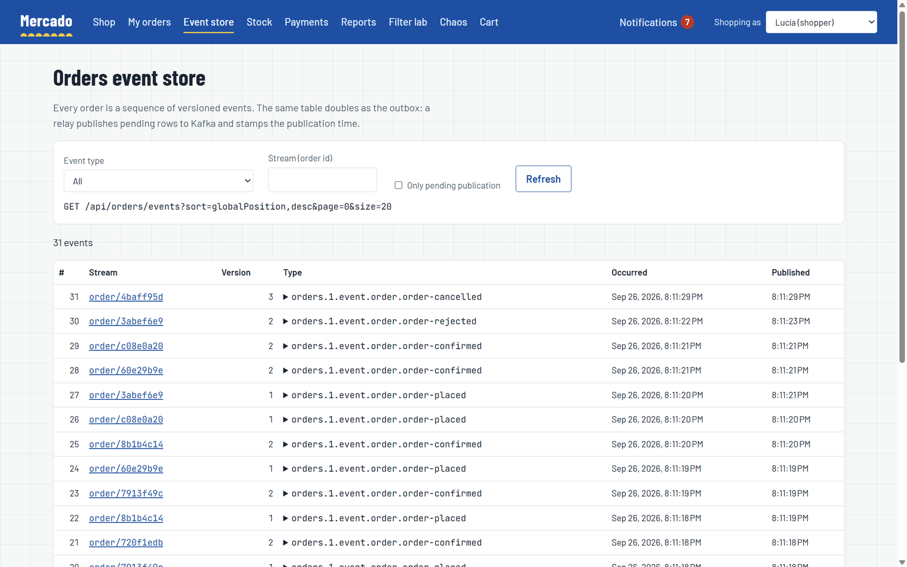

# Event sourcing y outbox transaccional

Cada servicio que publica eventos los guarda en una única tabla, `event_store`, proporcionada por [`platform/es-kit`](../../platform/es-kit). Para orders y payments esa tabla es la fuente de verdad: un pedido o un pago es su stream de eventos, y su estado se reconstruye reproduciéndolos. Para catalog e inventory, que guardan su estado en tablas normales, la misma tabla es solo el outbox. En ambos casos, escribir un evento y "enviarlo" es el mismo insert, en la misma transacción que el cambio de negocio, de modo que un evento se publica si y solo si el cambio se confirma. Un relay publica las filas pendientes en Kafka en orden global una vez que el broker las confirma, la entrega es at-least-once (al menos una vez) y todos los consumidores son idempotentes y toleran que los eventos lleguen desordenados entre tipos.

<p align="center"></p>

## La tabla del event store

La crea la migración de es-kit [`V1000__event_store.sql`](../../platform/es-kit/src/main/resources/db/eskit/V1000__event_store.sql) en la base de datos de cada servicio que incluye es-kit:

| Columna | Tipo | Propósito |
|---|---|---|
| `global_position` | `bigserial`, clave primaria | Orden global del store; el relay publica siguiéndolo. |
| `event_id` | `uuid`, único | Id del mensaje de spring-boot-cqrs. Sobrevive al paso por Kafka, y los consumidores deduplican con él. |
| `stream_type`, `stream_id` | `varchar` | El stream al que pertenece el evento (`order` + id de pedido, `payment` + id de pedido, `product` + id de producto, `reservation` + id de pedido, `stock` + id de producto). |
| `version` | `bigint`, admite nulos | Posición en un stream con event sourcing, desde 1. `null` para las filas de outbox de agregados basados en estado. |
| `event_type` | `varchar(200)` | Nombre en el cable según `@CqrsMessage`, por ejemplo `shop.orders.1.event.order.order-placed`. [`EventTypeRegistry`](../../platform/es-kit/src/main/java/com/borjaglez/shop/eskit/EventTypeRegistry.java) lo asocia a la clase. |
| `payload` | `jsonb` | El evento serializado. |
| `metadata` | `jsonb` | El `MessageContext` de spring-boot-cqrs de la petición (correlation id y entradas relacionadas) más las cabeceras de traza W3C capturadas por `TraceCarrier`. |
| `occurred_at` | `timestamptz` | Cuándo se guardó el evento. |
| `published_at` | `timestamptz`, admite nulos | Cuándo el relay entregó el evento al broker; `null` mientras está pendiente. |
| `publish_attempts`, `last_error` | `int`, `varchar(1000)` | Intentos de publicación fallidos y el último error. |

Índices:

- `event_store_stream_version_uq`: único `(stream_type, stream_id, version)` donde `version is not null`. Es la protección de concurrencia optimista de los streams con event sourcing.
- `event_store_pending_idx`: `(global_position)` donde `published_at is null`, que mantiene baratas la consulta del relay y las métricas de backlog sea cual sea el tamaño del store.
- `event_store_stream_idx` y `event_store_type_idx` para cargar streams y explorar por tipo.

La siguiente migración de es-kit, [`V1000_1__cqrs_processed_message.sql`](../../platform/es-kit/src/main/resources/db/eskit/V1000_1__cqrs_processed_message.sql), crea `cqrs_processed_message (handler_id, message_id, processed_at)`, las marcas de idempotencia de los consumidores. Flyway es el dueño del esquema, así que los servicios fijan `cqrs.jdbc.initialize-schema=never` (un valor por defecto de `service-support`).

## Dos formas de usar la misma tabla

| | Con event sourcing | Basado en estado con outbox |
|---|---|---|
| Servicios | orders ([`Order`](../../services/orders-service/src/main/java/com/borjaglez/shop/orders/domain/Order.java)), payments ([`Payment`](../../services/payments-service/src/main/java/com/borjaglez/shop/payments/domain/Payment.java)) | catalog (`Product`), inventory (`StockItem`, `Reservation`) |
| Fuente de verdad | el stream en `event_store` | las tablas de las entidades |
| API | `AggregateStore.load` / `save` -> `EventStore.append` | `EventStore.record` |
| `version` | 1, 2, 3... por stream | `null` |
| Concurrencia | versión esperada comprobada al añadir | `@Version` de JPA en las entidades |

### Agregados con event sourcing

Un agregado extiende [`EventSourcedAggregate`](../../platform/es-kit/src/main/java/com/borjaglez/shop/eskit/EventSourcedAggregate.java). Los métodos de comando validan y llaman a `apply(event)`; `when(event)` es el único lugar que modifica el estado; la carga reproduce los eventos guardados a través del mismo `when`. Por tanto, el estado tras un comando y tras una recarga es idéntico por construcción.

```java
public void confirm(UUID paymentId) {
  if (status == OrderStatus.CONFIRMED) {
    return;
  }
  requireInCheckout("confirm");
  apply(new OrderConfirmed(orderId, paymentId));
}

@Override
protected void when(Event event) {
  switch (event) {
    case OrderPlaced placed -> { /* id, customer, lines, total, status = PLACED */ }
    case OrderConfirmed confirmed -> {
      paymentId = confirmed.getPaymentId();
      status = OrderStatus.CONFIRMED;
    }
    case OrderRejected rejected -> status = OrderStatus.REJECTED;
    case OrderCancelled cancelled -> status = OrderStatus.CANCELLED;
    default -> throw new IllegalArgumentException("Unexpected event " + event.getClass());
  }
}
```

[`AggregateStore`](../../platform/es-kit/src/main/java/com/borjaglez/shop/eskit/AggregateStore.java) carga y guarda un tipo de agregado. Cada servicio declara un bean por tipo de stream:

```java
@Bean
AggregateStore<Order> orderStore(EventStore eventStore) {
  return new AggregateStore<>(eventStore, Order.STREAM_TYPE, Order::new);
}
```

Un handler de comandos carga, decide y guarda; los nuevos eventos se añaden con la versión que leyó el handler:

```java
Order order = orders.load(command.getOrderId().toString())
    .filter(o -> o.belongsTo(command.getCustomerId()))
    .orElseThrow(() -> new NotFoundException("order-not-found", "Unknown order " + command.getOrderId()));
order.cancel(command.getCustomerId(), command.getReason());
orders.save(order);
```

### Agregados basados en estado

El catálogo guarda los productos como entidades JPA normales y registra en la misma transacción los eventos que ha acumulado el agregado:

```java
private void publish(Product product) {
  var events = product.pullEvents();
  if (!events.isEmpty()) {
    eventStore.record("product", product.getId().toString(), events);
  }
}
```

Inventory hace lo mismo con `StockReserved`, `StockReleased` (stream `reservation`) y `StockAdjusted` (stream `stock`). Mantener ambos estilos sobre la misma infraestructura hace visible la diferencia: al relay, al explorador y a los consumidores les da igual cuál de los dos escribió una fila.

## Concurrencia optimista

[`EventStore.append`](../../platform/es-kit/src/main/java/com/borjaglez/shop/eskit/EventStore.java) compara la versión actual del stream con la versión que cargó quien llama. Si difieren, o si una transacción concurrente inserta la misma versión entre la comprobación y el insert (el índice único lo rechaza), lanza [`ConcurrencyConflictException`](../../platform/es-kit/src/main/java/com/borjaglez/shop/eskit/ConcurrencyConflictException.java). Es una `ConflictException`, así que la API responde 409 `concurrent-modification` y el cliente puede recargar y reintentar. Las entidades basadas en estado obtienen la misma respuesta a partir de su `@Version` de JPA mediante `DataAccessProblemMapper`.

## El relay del outbox

<p align="center"></p>

Un servicio activa el relay declarando un bean [`OutboxDestination`](../../platform/es-kit/src/main/java/com/borjaglez/shop/eskit/OutboxDestination.java); catalog, orders, inventory y payments declaran `KafkaOutboxDestination`. Reporting incluye es-kit solo por sus marcas de idempotencia y sus métricas de consumidores, y no declara ninguno.

[`OutboxRelay`](../../platform/es-kit/src/main/java/com/borjaglez/shop/eskit/OutboxRelay.java) se ejecuta en su propio hilo (`OutboxRelayScheduler`, un `SmartLifecycle` que arranca cuando el contexto está listo y se detiene antes de que desaparezca la base de datos), cada `shop.outbox.relay.interval` (500 ms por defecto):

```sql
select * from event_store where published_at is null
order by global_position limit :batch for update skip locked
```

1. Cada lote (`shop.outbox.relay.batch-size`, 100 por defecto) se ejecuta en una transacción y bloquea sus filas con `FOR UPDATE SKIP LOCKED`, de modo que varias réplicas de un servicio hacen de relay en paralelo sin publicar dos veces la misma fila.
2. Las filas se publican en orden de `global_position`. Cada una se deserializa, su correlation id se restaura en el `MessageContext`, su traza se reanuda (`TraceCarrier`) y se entrega al destino.
3. `KafkaOutboxDestination` publica mediante el `KafkaMessagePublisher` de spring-boot-cqrs y solo retorna cuando Kafka ha confirmado el registro. Un fallo del broker aflora como una excepción.
4. Una fila publicada recibe `published_at`. Al primer fallo el lote se detiene: se incrementa el `publish_attempts` de la fila y `last_error` registra el motivo, las filas anteriores se confirman como publicadas y la fila fallida se reintenta en la siguiente ejecución. Con una sola instancia haciendo de relay, un evento posterior nunca adelanta a uno anterior.
5. El bucle continúa con el siguiente lote hasta que un lote es menor que el tamaño de lote o falla.

Una fila que nunca se puede publicar (por ejemplo, un tipo de evento que ya no existe) bloquea por diseño las filas que tiene detrás; `publish_attempts` y `last_error` la hacen visible en el explorador del event store, y `shop.outbox.oldest.age.seconds` dispara la alerta "Events are not reaching Kafka" (los eventos no llegan a Kafka). Consulta [Observabilidad](observability.md).

El relay registra además dos fallos de demostración, `relay.paused` (deja de publicar, como si Kafka estuviera caído) y `relay.duplicate` (publica cada evento dos veces). Consulta [Resiliencia y escalado](resilience-and-scaling.md#panel-de-caos).

| Propiedad | Por defecto | Significado |
|---|---|---|
| `shop.outbox.relay.enabled` | `true` | Si se ejecuta el relay programado |
| `shop.outbox.relay.interval` | `500ms` | Pausa entre ejecuciones |
| `shop.outbox.relay.batch-size` | `100` | Filas bloqueadas y publicadas por transacción |
| `shop.event-store.event-packages` | `com.borjaglez.shop.contracts` | Dónde se buscan los eventos `@CqrsMessage` |

spring-boot-cqrs incluye su propio outbox transaccional en `spring-boot-cqrs-jdbc` (`OutboxEventBus` más un relay sobre una tabla `cqrs_outbox`, `cqrs.outbox.enabled`), pensado para aplicaciones cuyos eventos no se guardan de todos modos. Mercado publica desde su event store: para orders y payments el event store ya es la fuente de verdad, y escribir cada evento en una segunda tabla no aportaría nada. Un servicio basado en estado sin event store usaría `OutboxEventBus`.

## Entrega at-least-once y consumidores idempotentes

Si el relay publica una fila y el proceso muere antes de que se confirme la transacción, la fila sigue pendiente y se publicará de nuevo. Kafka también puede volver a entregar mensajes a un consumer group durante un rebalanceo. Por tanto, la entrega es at-least-once, y cada consumidor aplica cada evento como mucho una vez: cada método `@HandleEvent` de un proyector lleva el `@Idempotent` de spring-boot-cqrs, con el nombre del consumidor como id del handler.

```java
@EventHandler
public class OrderViewProjector {

  static final String CONSUMER = "orders.order-view";

  @HandleEvent
  @Idempotent(name = CONSUMER)
  public void on(OrderConfirmed event) {
    apply(event.getOrderId(), view -> view.confirmed(event.getPaymentId(), at(event)));
  }
  ...
}
```

Las marcas viven en `cqrs_processed_message (handler_id, message_id)`, con el id del evento como clave, y las escribe el `JdbcIdempotencyStore` de `spring-boot-cqrs-jdbc`. La librería abre una transacción alrededor del handler (o se une a la actual si la hay) e inserta la marca en ella, así que la marca y el trabajo del handler en base de datos se confirman juntos: si el handler falla, no se guarda ninguno de los dos y la nueva entrega lo vuelve a ejecutar; si tiene éxito, las nuevas entregas se omiten. La clave primaria también impide dos entregas concurrentes del mismo evento: la segunda espera a la fila sin confirmar y después ve un duplicado. Las marcas con más antigüedad que `cqrs.idempotency.retention` (7 días por defecto) se borran periódicamente, así que la retención debe ser mayor que lo que un evento puede esperar antes de volver a entregarse.

[`ConsumerMetrics`](../../platform/es-kit/src/main/java/com/borjaglez/shop/eskit/ConsumerMetrics.java), de es-kit, envuelve el almacén (es-kit declara el bean `IdempotentInvoker` con el almacén envuelto) y, como middleware del bus, conoce el evento que se está despachando. Cuenta `shop.consumer.events` por `outcome` (`applied` o `duplicate`) y mide `shop.consumer.lag`, el tiempo entre el evento y su proyección, ambos etiquetados con el nombre del consumidor.

Nombres de consumidores: `orders.catalog-products`, `orders.order-view`, `inventory.catalog-products`, `reporting.orders`. `notifications-service` (Boot 3.5, sin es-kit) usa `@Idempotent` con el mismo almacén JDBC (`notifications.notices`), sin las métricas `shop.consumer`, y además usa el id del evento como clave de cada aviso.

## Orden

spring-boot-cqrs publica cada evento en el topic compartido `shop.events`, con su nombre de mensaje como clave. Kafka mantiene el orden dentro de una partición, así que el orden está garantizado por tipo de evento, no por agregado: un `OrderCancelled` puede llegar a un consumidor antes que el `OrderPlaced` que cancela, y un `ProductPriceChanged` antes que el `ProductPublished` del mismo producto. Las proyecciones están escritas para converger sea cual sea el orden de entrega:

- **Marcas de tiempo de vigencia.** [`CatalogProduct`](../../services/orders-service/src/main/java/com/borjaglez/shop/orders/domain/CatalogProduct.java) guarda, para cada grupo de atributos (detalles, precio, disponibilidad), el momento del evento que lo fijó (`details_as_of`, `price_as_of`, `availability_as_of`) e ignora los eventos más antiguos. Un `ProductPublished` tardío ni deshace un precio más reciente ni vuelve a poner a la venta un producto descatalogado.
- **Estado monótono.** [`OrderView`](../../services/orders-service/src/main/java/com/borjaglez/shop/orders/domain/OrderView.java) y `ReportOrder` crean la fila con el primer evento que llegue, y el estado solo avanza. Un `OrderPlaced` tardío completa los detalles de un pedido que ya se sabe cancelado sin reabrirlo. Hasta entonces la fila no tiene cliente, así que ningún cliente la ve en su listado.
- **Bloqueo optimista en las proyecciones.** Las filas de las proyecciones llevan un `row_version`; dos consumidores que actualizan la misma fila no pueden sobrescribirse. El que pierde falla, Kafka vuelve a entregar y el evento se aplica sobre datos frescos.
- **Esperar al propietario.** Un aviso cuyo pedido aún no se conoce se guarda sin cliente y se asigna en cuanto llega `OrderPlaced`. Consulta [Modelos de lectura](read-models.md#notifications-service).

## Consultar el event store

| Endpoint | Origen | Consistencia |
|---|---|---|
| `GET /api/orders`, `GET /api/orders/{id}` | `order_view`, filtrado con specification-repository | Eventual: se actualiza desde Kafka un instante después del comando |
| `GET /api/orders/{id}/history` | el stream del pedido, reproducido evento a evento para mostrar el estado tras cada versión, con el `publishedAt` de cada evento | Inmediata |
| `GET /api/orders/events` | todo el event store de orders, con filtros HTTP sobre `eventType`, `streamType`, `streamId`, `version`, `occurredAt`, `publishedAt`, `publishAttempts`; los más recientes primero por defecto | Inmediata |
| `GET /api/payments/{orderId}/history` | el stream del pago | Inmediata |

La página de pedido de la tienda muestra ambos lados a la vez: la saga y el modelo de lectura, y el historial del event store con cada evento marcado como publicado o todavía pendiente en el outbox. La página Event store (`/event-store`) es el explorador, útil para ver el relay en acción o para encontrar una fila con `publish_attempts > 0`:



## Organización de Flyway

Cada servicio incluye dos ubicaciones de Flyway y un único historial de esquema:

```yaml
spring:
  flyway:
    locations: classpath:db/migration,classpath:db/eskit
    out-of-order: true
```

- Las migraciones del servicio viven en `db/migration` y se numeran `V1`, `V2`...
- Las de es-kit viven en `db/eskit` y empiezan en `V1000`, y cualquier migración posterior de es-kit continúa esa serie, de modo que las dos secuencias nunca colisionan.
- Como una nueva migración del servicio tiene un número inferior a las de es-kit y aun así debe aplicarse, los servicios fijan `out-of-order: true`.
- Una migración del servicio que escribe en tablas de es-kit se numera a partir de `V1001`, para que se ejecute después de `V1000` en una base de datos nueva. La migración [`V1001__publish_seed_products.sql`](../../services/catalog-service/src/main/resources/db/migration/V1001__publish_seed_products.sql) del catálogo registra un `ProductPublished` por cada producto inicial, y el relay los envía a Kafka como cualquier otro evento, de modo que orders, inventory y reporting construyen sus propias copias del catálogo inicial.
- Las migraciones aplicadas nunca se editan: Flyway valida sus checksums.

Las imágenes nativas solo contienen los recursos registrados en tiempo de build; [`EsKitRuntimeHints`](../../platform/es-kit/src/main/java/com/borjaglez/shop/eskit/EsKitRuntimeHints.java) registra `db/eskit/**` junto al propio `db/migration` de Spring Boot.

## Relacionado

- [Arquitectura](architecture.md)
- [Las librerías en la práctica](libraries.md)
- [Saga de checkout](checkout-saga.md)
- [Modelos de lectura](read-models.md)
- [Observabilidad](observability.md)
- [Resiliencia y escalado](resilience-and-scaling.md)
