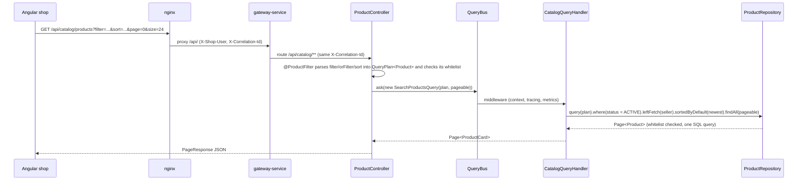
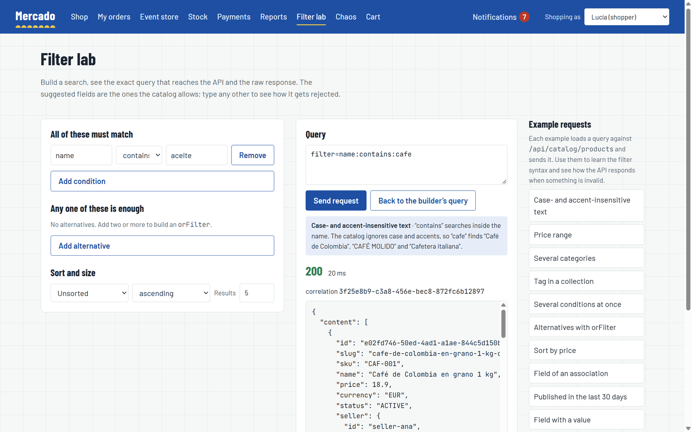

# Consultas: la búsqueda del catálogo de extremo a extremo

La búsqueda pública del catálogo es el ejemplo más completo de cómo Mercado convierte una petición HTTP en SQL con spring-boot-specification-repository. El cliente describe lo que quiere con los parámetros repetibles `filter`, `orFilter` y `sort`; `@FilterableQuery` los convierte en un `QueryPlan` restringido a una lista blanca de campos, con búsqueda de texto sin distinguir mayúsculas; el controlador envía el plan por el bus de consultas; y el handler lo deriva con las condiciones que el cliente no debe controlar (solo productos a la venta, el vendedor cargado en la misma consulta) antes de ejecutarlo. Las facetas reutilizan el mismo plan con consultas agrupadas. Una entrada no válida nunca llega a la base de datos: se responde con un problema 400 `invalid-filter`. Esta página sigue una petición a través de cada paso y enumera el contrato en el que se apoya el frontend.

## Flujo de una petición



## El contrato HTTP

```
GET /api/catalog/products
    ?filter=categories.slug:eq:cafe-e-infusiones      # every filter must match (AND)
    &filter=price.amount:between:5|20                 # lists and ranges separated by |
    &orFilter=name:contains:tueste;tags:eq:ecologico  # one condition of the group is enough (OR)
    &sort=price.amount,asc
    &page=0&size=24
```

| Parte | Sintaxis | Notas |
|---|---|---|
| `filter` | `field:operator[:value]` | Repetible; todas las condiciones se combinan con AND |
| `orFilter` | `cond;cond;...` | Repetible; cada grupo necesita al menos una condición que se cumpla |
| `sort` | `field,asc` / `field,desc` | Repetible; solo campos ordenables |
| `page`, `size` | enteros | `size` vale 20 por defecto y tiene un máximo de 100 (`spring.data.web.pageable.*`) |

Cada petición se acota antes de ejecutar ningún SQL (`specrepository.http.*`, consulta [Las librerías en la práctica](libraries.md#límites-y-operadores)): como mucho 10 condiciones `filter` y `orFilter`, 3 campos `sort`, 50 valores en una lista `in` o `notin` y 100 caracteres por valor en el catálogo. Por encima, la respuesta es un 400 `invalid-filter`.

Operadores:

| Operador | Significado | Valor |
|---|---|---|
| `eq`, `neq` | igual, distinto | uno |
| `contains`, `notcontains`, `startswith`, `endswith` | búsqueda de texto | uno |
| `gt`, `gte`, `lt`, `lte` | comparaciones (números, fechas) | uno |
| `between` | rango inclusivo | dos, `from\|to` |
| `in`, `notin` | pertenencia | lista, `a\|b\|c` |
| `isnull`, `isnotnull` | comprobaciones de nulo | ninguno |
| `isempty`, `isnotempty` | la colección no tiene elementos / tiene alguno | ninguno |

Las fechas van en ISO-8601 con offset, porque `publishedAt` es un `OffsetDateTime` (`publishedAt:gte:2026-09-01T00:00:00Z`). Los campos anidados navegan por asociaciones (`seller.city`, `categories.slug`) y por colecciones de elementos (`tags`).

La sintaxis no tiene escapado: `|` separa los valores de una lista y `;` separa las alternativas, y los valores vacíos no se pueden expresar. El [`filter-serializer.ts`](../../frontend/src/app/core/filters/filter-serializer.ts) del frontend rechaza esos valores antes de enviarlos, en lugar de dejar que el servidor los divida.

La respuesta es un [`PageResponse`](../../platform/service-support/src/main/java/com/borjaglez/shop/support/web/PageResponse.java): `content`, `page`, `size`, `totalElements`, `totalPages`.

## Campos en la lista blanca

[`ProductController`](../../services/catalog-service/src/main/java/com/borjaglez/shop/catalog/api/ProductController.java) declara los campos con [`@ProductFilter`](../../services/catalog-service/src/main/java/com/borjaglez/shop/catalog/api/ProductFilter.java), una anotación compuesta meta-anotada con `@FilterableQuery` que comparten la búsqueda y las facetas:

```java
@FilterableQuery(
    value = Product.class,
    filterableFields = {
      "name", "description", "sku", "price.amount", "status",
      "categories.slug", "tags", "seller.id", "seller.city", "publishedAt"
    },
    caseInsensitiveFields = {"name", "description"})
@interface ProductFilter {

  @AliasFor(annotation = FilterableQuery.class)
  String[] sortableFields() default {};
}
```

```java
@GetMapping
PageResponse<ProductCard> search(
    @ProductFilter(sortableFields = {"name", "sku", "price.amount", "publishedAt"})
        QueryPlan<Product> plan,
    Pageable pageable) {
  Page<ProductCard> page = queries.ask(new SearchProductsQuery(plan, pageable));
  return PageResponse.of(page);
}

@GetMapping("/facets")
CatalogFacets facets(@ProductFilter QueryPlan<Product> plan) {
  return queries.ask(new GetCatalogFacetsQuery(plan));
}
```

`seller.email` existe en la entidad pero es privado: no está en ninguna de las dos listas, así que nunca se puede filtrar ni ordenar por él, y las vistas de producto nunca lo exponen. La lista blanca se comprueba al resolver el argumento, de modo que un campo no permitido se rechaza antes de que se ejecute el método del controlador. El `Pageable` se pasa tal cual: su ordenación sale del mismo parámetro `sort` y el repositorio la comprueba contra la misma lista blanca. Las facetas no declaran campos ordenables, así que un `sort` sobre ellas también se rechaza.

Los compradores escriben "cafe" y esperan encontrar "Café". La sintaxis HTTP no permite pedir coincidencias sin distinguir mayúsculas, así que el servidor lo decide para los campos que sabe que son texto: `caseInsensitiveFields` hace que `eq`, `neq`, `contains`, `notcontains`, `startswith` y `endswith` sobre `name` y `description` comparen `unaccent(upper(...))` en ambos lados, lo que en PostgreSQL ignora mayúsculas y acentos (la primera migración del catálogo crea la extensión `unaccent`). El término de búsqueda llega a la base de datos como parámetro enlazado, así que `filter=name:contains:d'oliva` encuentra "Aceite d'Oliva de l'Empordà" como cualquier otro término.

## Lo que añade el servidor

[`CatalogQueryHandler`](../../services/catalog-service/src/main/java/com/borjaglez/shop/catalog/application/query/CatalogQueryHandler.java) recibe el plan del cliente y lo deriva con `products.query(plan)`:

```java
static final Sort NEWEST_FIRST = Sort.by(Sort.Order.desc("publishedAt"), Sort.Order.asc("id"));

@HandleQuery
@Transactional(readOnly = true, timeout = SEARCH_TIMEOUT_SECONDS) // 5 s
public Page<ProductCard> search(SearchProductsQuery query) {
  return onSale(query.getPlan())
      .leftFetch("seller")
      .sortedByDefault(NEWEST_FIRST)
      .findAll(query.getPageable())
      .map(ProductViews::card);
}

private SpecificationExecutableQuery<Product> onSale(QueryPlan<Product> clientPlan) {
  return products.query(clientPlan).where("status", Operators.EQUALS, ProductStatus.ACTIVE);
}
```

| Paso | Por qué |
|---|---|
| `where(status = ACTIVE)` | El público nunca ve borradores ni productos descatalogados, aunque filtre por `status`. En una consulta derivada es una condición del servidor: se combina con AND con los filtros del cliente, no se comprueba contra la lista blanca y un `orFilter` nunca la amplía. Los filtros y la ordenación del propio cliente siguen sujetos a su lista blanca. |
| `leftFetch("seller")` | El vendedor se carga en la misma consulta (left fetch join), evitando una consulta por producto. |
| `sortedByDefault(NEWEST_FIRST)` | Sin `sort`, los productos más recientes van primero, y después por `id`. Una ordenación fijada en una consulta derivada es del servidor: `id` no es un campo ordenable, pero no se comprueba contra la lista blanca, y mantiene en un orden estable entre páginas los productos publicados en el mismo instante. Un `sort=id,asc` del cliente sigue siendo un 400. |
| `timeout = 5` | El timeout de la transacción acota todas las consultas de la búsqueda: una combinación de filtros que los índices no cubren no puede retener una conexión mucho tiempo. |

## Facetas

`GET /api/catalog/products/facets` acepta los mismos filtros y responde cuántos productos a la venta coinciden por categoría, por vendedor y por etiqueta, además del rango de precios (forma de la respuesta; los valores son ilustrativos):

```json
{
  "categories": [{ "value": "vinos", "label": "Vinos", "count": 7 }],
  "sellers":    [{ "value": "seller-bruno", "label": "Almazara Bruno", "count": 5 }],
  "tags":       [{ "value": "ecologico", "label": "ecologico", "count": 9 }],
  "price":      { "min": 3.20, "max": 64.00 }
}
```

Cada faceta es una consulta agrupada sobre los productos a la venta, leída con `findRows()`, que cuenta productos distintos (`countDistinctAs("total", "id")`, porque el join con categorías o etiquetas multiplica las filas); el rango de precios lee una fila de `minAs`/`maxAs` de `price.amount` con `findRow()`. Los valores se ordenan por número y se limitan a 20 por faceta.

Las facetas son **disyuntivas**: cada faceta ignora el propio filtro del cliente sobre su campo, de modo que un comprador que ha seleccionado un vendedor sigue viendo los demás vendedores con sus recuentos y puede añadirlos. Una consulta derivada puede añadir condiciones pero no quitar las del cliente, así que [`QueryPlans.without(plan, field)`](../../platform/service-support/src/main/java/com/borjaglez/shop/support/query/QueryPlans.java) elimina las condiciones de primer nivel sobre ese campo antes de agrupar; los grupos de alternativas (`orFilter`) se conservan completos.

```java
return new CatalogFacets(
    countBy(onSale(QueryPlans.without(client, "categories.slug")), "categories.slug", "categories.name"),
    countBy(onSale(QueryPlans.without(client, "seller.id")), "seller.id", "seller.displayName"),
    countBy(onSale(QueryPlans.without(client, "tags")), "tags", null),
    priceRange(onSale(QueryPlans.without(client, "price.amount"))));
```

```java
private static List<FacetValue> countBy(
    SpecificationExecutableQuery<Product> query, String valueField, String labelField) {
  String[] groupBy =
      labelField == null ? new String[] {valueField} : new String[] {valueField, labelField};
  List<GroupedRow> rows =
      query.groupBy(groupBy).select(groupBy).countDistinctAs("total", "id").findRows();
  ...
}
```

`GET /api/catalog/categories` usa la misma agrupación para devolver cada categoría con su número de productos activos.


## Filtros no válidos

Todo filtro rechazado es un problema RFC 9457 400 con código `invalid-filter`; no se lee ninguna fila.

| Petición | Lo detecta | Detalle del problema |
|---|---|---|
| `filter=seller.email:startswith:ana` | lista blanca, al resolver el argumento (`DisallowedFieldException`) | `Field 'seller.email' is not allowed for filtering` |
| `sort=seller.email,asc` | lista blanca | `Field 'seller.email' is not allowed for sorting` |
| `filter=price.amount:gte:abc` | conversión de valores (`InvalidFilterValueException`) | `Invalid filter on field 'price.amount': cannot convert 'abc' to BigDecimal` |
| `filter=name:like:cafe` | parser HTTP, operador fuera de `allowed-operators` (`HttpUnknownOperatorException`) | `Unknown filter operator 'like'` |
| `filter=seller.id:in:` con 51 vendedores | parser HTTP, `max-values-per-filter` (`HttpFilterSyntaxException`) | `Invalid filter expression 'seller.id:in': too many values (max 50) for field 'seller.id'` |
| `filter=name:contains:` con 101 caracteres | parser HTTP, `max-value-length` | `... value too long (max 100 characters) for field 'name'` (el valor no se repite) |
| parámetro mal formado | parser HTTP (`HttpFilterSyntaxException`) | el mensaje del parser |

```json
{
  "type": "https://shop.borjaglez.com/problems/invalid-filter",
  "title": "Bad Request",
  "status": 400,
  "detail": "Field 'seller.email' is not allowed for filtering",
  "instance": "/api/catalog/products",
  "code": "invalid-filter",
  "field": "seller.email",
  "correlationId": "5b1d0c9e-2f4a-4b7e-8a61-0f3c2d9e7a44"
}
```

[`SpecificationProblemMapper`](../../platform/service-support/src/main/java/com/borjaglez/shop/support/web/problem/SpecificationProblemMapper.java), de `service-support`, genera estas respuestas: para los errores encontrados al parsear (`HttpFilterSyntaxException`, `HttpUnknownOperatorException`), los campos no permitidos (`DisallowedFieldException`) y los filtros que el motor de consultas rechaza al ejecutarse, como los valores no convertibles (`InvalidFilterException`). Cuando la excepción nombra un campo, el problema lo lleva en `field`, como los problem details de la propia librería. Como el handler recorre la cadena de causas, la respuesta es la misma tanto si la excepción se lanza en el controlador como dentro del bus de consultas. El advice de la librería para estas excepciones está desactivado (`specrepository.http.problem-details.enabled=false`) para que todos los errores de la tienda tengan la misma forma.

## El Filter Lab

La tienda incluye una página Filter Lab (laboratorio de filtros, `/lab`) para experimentar con la sintaxis contra la API real. Las condiciones y los criterios de ordenación se construyen con un formulario (o editando a mano la query string), y la página muestra la query string exacta y la respuesta sin procesar, problemas incluidos. También ofrece peticiones predefinidas ([`lab-presets.ts`](../../frontend/src/app/features/lab/lab-presets.ts)), cada una con una explicación del resultado esperado:

| Preset | Query string |
|---|---|
| Case- and accent-insensitive text (texto sin distinguir mayúsculas ni acentos) | `filter=name:contains:cafe` |
| Price range, cheapest first (rango de precios, los más baratos primero) | `filter=price.amount:between:5%7C20&sort=price.amount,asc` |
| Several categories (varias categorías) | `filter=categories.slug:in:vinos%7Cconservas` |
| Tag in an element collection (etiqueta en una colección de elementos) | `filter=tags:eq:ecologico` |
| Several conditions (AND) (varias condiciones) | `filter=tags:eq:ecologico&filter=price.amount:lt:10` |
| Alternatives (OR) (alternativas) | `orFilter=name:contains:queso;tags:eq:navidad` |
| Sort by price, descending (ordenar por precio, descendente) | `filter=categories.slug:eq:vinos&sort=price.amount,desc` |
| Field of an association (campo de una asociación) | `filter=seller.city:eq:Jaén` |
| Published in the last 30 days (publicados en los últimos 30 días) | `filter=publishedAt:gte:<date>T00:00:00Z&sort=publishedAt,desc` |
| Field with a value (campo con valor) | `filter=publishedAt:isnotnull` |
| Empty collection (colección vacía) | `filter=tags:isempty` |
| Field not allowed (campo no permitido) | `filter=seller.email:startswith:ana` |
| Sort not allowed (ordenación no permitida) | `sort=seller.email,asc` |
| Malformed value (valor mal formado) | `filter=price.amount:gte:abc` |
| Unknown operator (operador desconocido) | `filter=name:like:cafe` |



Las mismas peticiones funcionan desde la línea de comandos a través del gateway:

```bash
curl -s 'http://localhost:8080/api/catalog/products?filter=name:contains:cafe&sort=price.amount,asc'
curl -s 'http://localhost:8080/api/catalog/products/facets?filter=tags:eq:ecologico'
curl -s 'http://localhost:8080/api/catalog/products?filter=seller.email:startswith:ana'   # 400 invalid-filter
```

## El mismo patrón en el resto de la plataforma

Todos los endpoints de listado de la plataforma siguen el patrón del catálogo: `@FilterableQuery` con una lista blanca (compartida mediante una anotación compuesta cuando varios endpoints exponen la misma entidad), el `Pageable` pasado tal cual, y condiciones y ordenaciones por defecto del servidor añadidas al derivar el plan con `repository.query(plan)`. Las listas blancas de todos los endpoints aparecen en [Las librerías en la práctica](libraries.md#filtros-http-con-filterablequery).

## Relacionado

- [Las librerías en la práctica](libraries.md)
- [Arquitectura](architecture.md#modelo-de-errores)
- [Modelos de lectura](read-models.md#informes)
- [Event sourcing y outbox](event-sourcing-and-outbox.md#consultar-el-event-store)
