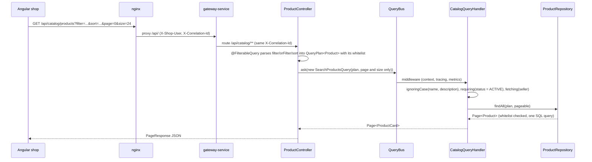

# Consultas: la búsqueda del catálogo de extremo a extremo

La búsqueda pública del catálogo es el ejemplo más completo de cómo Mercado convierte una petición HTTP en SQL con spring-boot-specification-repository. El cliente describe lo que quiere con los parámetros repetibles `filter`, `orFilter` y `sort`; `@FilterableQuery` los convierte en un `QueryPlan` restringido a una lista blanca de campos; el controlador envía el plan por el bus de consultas; y el handler compone las condiciones que el cliente no debe controlar (solo productos a la venta, texto sin distinguir mayúsculas, el vendedor cargado en la misma consulta) antes de ejecutarlo. Las facetas reutilizan el mismo plan con consultas agrupadas. Una entrada no válida nunca llega a la base de datos: se responde con un problema 400 `invalid-filter`. Esta página sigue una petición a través de cada paso y enumera el contrato en el que se apoya el frontend.

## Flujo de una petición



## El contrato HTTP

```
GET /api/catalog/products
    ?filter=categories.slug:eq:cafe-e-infusiones      # every filter must match (AND)
    &filter=price.amount:between:5|20                 # lists and ranges separated by |
    &orFilter=name:contains:tueste;tags:eq:ecologico  # one condition of the group is enough (OR)
    &sort=price.amount,asc
    &page=0&size=24
```

| Parte | Sintaxis | Notas |
|---|---|---|
| `filter` | `field:operator[:value]` | Repetible; todas las condiciones se combinan con AND |
| `orFilter` | `cond;cond;...` | Repetible; cada grupo necesita al menos una condición que se cumpla |
| `sort` | `field,asc` / `field,desc` | Repetible; solo campos ordenables |
| `page`, `size` | enteros | `size` vale 20 por defecto y tiene un máximo de 100 (`spring.data.web.pageable.*`) |

Operadores:

| Operador | Significado | Valor |
|---|---|---|
| `eq`, `neq` | igual, distinto | uno |
| `contains`, `notcontains`, `startswith`, `endswith` | búsqueda de texto | uno |
| `gt`, `gte`, `lt`, `lte` | comparaciones (números, fechas) | uno |
| `between` | rango inclusivo | dos, `from\|to` |
| `in`, `notin` | pertenencia | lista, `a\|b\|c` |
| `isnull`, `isnotnull` | comprobaciones de nulo | ninguno |
| `isempty`, `isnotempty` | la colección no tiene elementos / tiene alguno | ninguno |

Las fechas van en ISO-8601 con offset, porque `publishedAt` es un `OffsetDateTime` (`publishedAt:gte:2026-09-01T00:00:00Z`). Los campos anidados navegan por asociaciones (`seller.city`, `categories.slug`) y por colecciones de elementos (`tags`).

La sintaxis no tiene escapado: `|` separa los valores de una lista y `;` separa las alternativas, y los valores vacíos no se pueden expresar. El [`filter-serializer.ts`](../../frontend/src/app/core/filters/filter-serializer.ts) del frontend rechaza esos valores antes de enviarlos, en lugar de dejar que el servidor los divida.

La respuesta es un [`PageResponse`](../../platform/service-support/src/main/java/com/borjaglez/shop/support/web/PageResponse.java): `content`, `page`, `size`, `totalElements`, `totalPages`.

## Campos en la lista blanca

[`ProductController`](../../services/catalog-service/src/main/java/com/borjaglez/shop/catalog/api/ProductController.java) declara los campos en el parámetro:

```java
@FilterableQuery(
        value = Product.class,
        filterableFields = {
          "name", "description", "sku", "price.amount", "status",
          "categories.slug", "tags", "seller.id", "seller.city", "publishedAt"
        },
        sortableFields = {"name", "sku", "price.amount", "publishedAt"})
    QueryPlan<Product> plan
```

`seller.email` existe en la entidad pero es privado: no está en ninguna de las dos listas, así que nunca se puede filtrar ni ordenar por él, y las vistas de producto nunca lo exponen. El controlador conserva solo el número y el tamaño de página del `Pageable` (`pagingOnly`): el parámetro `sort` también se convierte en parte del plan, donde la lista blanca lo valida, y una ordenación del `Pageable` se saltaría esa comprobación.

## Lo que añade el servidor

[`CatalogQueryHandler`](../../services/catalog-service/src/main/java/com/borjaglez/shop/catalog/application/query/CatalogQueryHandler.java) recibe el plan del cliente y lo completa con [`QueryPlans`](../../platform/service-support/src/main/java/com/borjaglez/shop/support/query/QueryPlans.java):

```java
private static final PredicateCondition ON_SALE =
    new PredicateCondition("status", Operators.EQUALS, ProductStatus.ACTIVE, false, false);
private static final Set<String> TEXT_FIELDS = Set.of("name", "description");

@HandleQuery
@Transactional(readOnly = true)
public Page<ProductCard> search(SearchProductsQuery query) {
  QueryPlan<Product> plan = QueryPlans.fetching(publicPlan(query.getPlan()), "seller");
  return products.findAll(plan, query.getPageable()).map(ProductViews::card);
}

/** Client filters, case-insensitive on text, restricted to products on sale. */
private static QueryPlan<Product> publicPlan(QueryPlan<Product> clientPlan) {
  return QueryPlans.requiring(QueryPlans.ignoringCase(clientPlan, TEXT_FIELDS), ON_SALE);
}
```

| Paso | Por qué |
|---|---|
| `ignoringCase(plan, {name, description})` | Los compradores escriben "cafe" y esperan encontrar "Café". La sintaxis HTTP no permite pedir coincidencias sin distinguir mayúsculas, así que el servicio lo decide para los campos que sabe que son texto; `contains`, `notcontains`, `startswith` y `endswith` sobre ellos ignoran mayúsculas y acentos. |
| `requiring(plan, status = ACTIVE)` | El público nunca ve borradores ni productos descatalogados, aunque filtre por `status`. `requiring` comprueba primero las condiciones y la ordenación del cliente contra la lista blanca y después añade la condición del servidor. |
| `fetching(plan, "seller")` | El vendedor se carga en la misma consulta (left fetch join), evitando una consulta por producto. |

## Facetas

`GET /api/catalog/products/facets` acepta los mismos filtros y responde cuántos productos a la venta coinciden por categoría, por vendedor y por etiqueta, además del rango de precios (forma de la respuesta; los valores son ilustrativos):

```json
{
  "categories": [{ "value": "vinos", "label": "Vinos", "count": 7 }],
  "sellers":    [{ "value": "seller-bruno", "label": "Almazara Bruno", "count": 5 }],
  "tags":       [{ "value": "ecologico", "label": "ecologico", "count": 9 }],
  "price":      { "min": 3.20, "max": 64.00 }
}
```

Cada faceta es un `findAllGrouped` sobre el plan público que cuenta productos distintos (`COUNT_DISTINCT` de `id`, porque el join con categorías o etiquetas multiplica las filas); el rango de precios usa `MIN` y `MAX` de `price.amount`. Los valores se ordenan por número y se limitan a 20 por faceta.

Las facetas son **disyuntivas**: cada faceta ignora el propio filtro del cliente sobre su campo, de modo que un comprador que ha seleccionado un vendedor sigue viendo los demás vendedores con sus recuentos y puede añadirlos. `QueryPlans.without(plan, field)` elimina las condiciones de primer nivel sobre ese campo antes de agrupar; los grupos de alternativas (`orFilter`) se conservan completos.

```java
return new CatalogFacets(
    countBy(publicPlan(QueryPlans.without(client, "categories.slug")), "categories.slug", "categories.name"),
    countBy(publicPlan(QueryPlans.without(client, "seller.id")), "seller.id", "seller.displayName"),
    countBy(publicPlan(QueryPlans.without(client, "tags")), "tags", null),
    priceRange(publicPlan(QueryPlans.without(client, "price.amount"))));
```

`GET /api/catalog/categories` usa la misma agrupación para devolver cada categoría con su número de productos activos.


## Filtros no válidos

Todo filtro rechazado es un problema RFC 9457 400 con código `invalid-filter`; nunca se consulta la base de datos.

| Petición | Lo detecta | Detalle del problema |
|---|---|---|
| `filter=seller.email:startswith:ana` | lista blanca (`DisallowedFieldException`) | `Field 'seller.email' is not allowed for filtering` |
| `sort=seller.email,asc` | lista blanca | `Field 'seller.email' is not allowed for sorting` |
| `filter=price.amount:gte:abc` | conversión de valores (`ConversionFailedException`) | `The value 'abc' is not a valid BigDecimal.` |
| `filter=name:like:cafe` | parser HTTP (`HttpUnknownOperatorException`) | `Unknown filter operator 'like'` |
| parámetro mal formado | parser HTTP (`HttpFilterSyntaxException`) | el mensaje del parser |

```json
{
  "type": "https://shop.borjaglez.com/problems/invalid-filter",
  "title": "Bad Request",
  "status": 400,
  "detail": "Field 'seller.email' is not allowed for filtering",
  "instance": "/api/catalog/products",
  "code": "invalid-filter",
  "correlationId": "5b1d0c9e-2f4a-4b7e-8a61-0f3c2d9e7a44"
}
```

Dos mappers de `service-support` generan estas respuestas: [`SpecificationHttpProblemMapper`](../../platform/service-support/src/main/java/com/borjaglez/shop/support/web/problem/SpecificationHttpProblemMapper.java) para los errores de sintaxis encontrados al parsear, y [`SpecificationQueryProblemMapper`](../../platform/service-support/src/main/java/com/borjaglez/shop/support/web/problem/SpecificationQueryProblemMapper.java) para los campos no permitidos, los valores no convertibles y los filtros que el motor de consultas rechaza al ejecutarse. Como el handler recorre la cadena de causas, la respuesta es la misma tanto si la excepción se lanza en el controlador como dentro del bus de consultas.

## El Filter Lab

La tienda incluye una página Filter Lab (laboratorio de filtros, `/lab`) para experimentar con la sintaxis contra la API real. Las condiciones y los criterios de ordenación se construyen con un formulario (o editando a mano la query string), y la página muestra la query string exacta y la respuesta sin procesar, problemas incluidos. También ofrece peticiones predefinidas ([`lab-presets.ts`](../../frontend/src/app/features/lab/lab-presets.ts)), cada una con una explicación del resultado esperado:

| Preset | Query string |
|---|---|
| Case- and accent-insensitive text (texto sin distinguir mayúsculas ni acentos) | `filter=name:contains:cafe` |
| Price range, cheapest first (rango de precios, los más baratos primero) | `filter=price.amount:between:5%7C20&sort=price.amount,asc` |
| Several categories (varias categorías) | `filter=categories.slug:in:vinos%7Cconservas` |
| Tag in an element collection (etiqueta en una colección de elementos) | `filter=tags:eq:ecologico` |
| Several conditions (AND) (varias condiciones) | `filter=tags:eq:ecologico&filter=price.amount:lt:10` |
| Alternatives (OR) (alternativas) | `orFilter=name:contains:queso;tags:eq:navidad` |
| Sort by price, descending (ordenar por precio, descendente) | `filter=categories.slug:eq:vinos&sort=price.amount,desc` |
| Field of an association (campo de una asociación) | `filter=seller.city:eq:Jaén` |
| Published in the last 30 days (publicados en los últimos 30 días) | `filter=publishedAt:gte:<date>T00:00:00Z&sort=publishedAt,desc` |
| Field with a value (campo con valor) | `filter=publishedAt:isnotnull` |
| Empty collection (colección vacía) | `filter=tags:isempty` |
| Field not allowed (campo no permitido) | `filter=seller.email:startswith:ana` |
| Sort not allowed (ordenación no permitida) | `sort=seller.email,asc` |
| Malformed value (valor mal formado) | `filter=price.amount:gte:abc` |
| Unknown operator (operador desconocido) | `filter=name:like:cafe` |


Las mismas peticiones funcionan desde la línea de comandos a través del gateway:

```bash
curl -s 'http://localhost:8080/api/catalog/products?filter=name:contains:cafe&sort=price.amount,asc'
curl -s 'http://localhost:8080/api/catalog/products/facets?filter=tags:eq:ecologico'
curl -s 'http://localhost:8080/api/catalog/products?filter=seller.email:startswith:ana'   # 400 invalid-filter
```

## El mismo patrón en el resto de la plataforma

Todos los endpoints de listado de la plataforma siguen el patrón del catálogo: `@FilterableQuery` con una lista blanca, página y tamaño a partir del `Pageable`, y condiciones y valores por defecto del servidor compuestos con `QueryPlans`. Las listas blancas de todos los endpoints aparecen en [Las librerías en la práctica](libraries.md#filtros-http-con-filterablequery).

## Relacionado

- [Las librerías en la práctica](libraries.md)
- [Arquitectura](architecture.md#modelo-de-errores)
- [Modelos de lectura](read-models.md#informes)
- [Event sourcing y outbox](event-sourcing-and-outbox.md#consultar-el-event-store)
