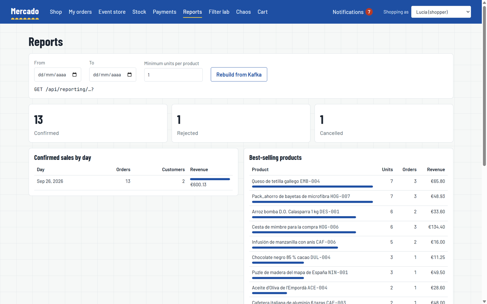

# Modelos de lectura

La mayor parte de lo que muestra la tienda no se lee del servicio propietario de los datos, sino de un modelo de lectura construido a partir de sus eventos: la lista de pedidos sale de `order_view`, los pedidos se valoran con una copia local del catálogo, inventory se entera de los productos por `ProductPublished`, los informes son consultas agrupadas sobre las propias tablas de reporting y los avisos son filas escritas por un servicio Spring Boot 3.5 a partir de eventos escritos por servicios Spring Boot 4. Cada proyección aplica cada evento una sola vez, converge sea cual sea el orden en que lleguen los eventos de distintos tipos y puede ir por detrás del lado de escritura el tiempo que tarden el outbox y Kafka, algo que la plataforma mide. Esta página describe cada modelo de lectura, qué lo alimenta y qué garantiza.

## Visión general

| Modelo de lectura | Servicio | Alimentado por | Consumidor | Se sirve en |
|---|---|---|---|---|
| `order_view`, `order_view_line` | orders | `OrderPlaced`, `OrderConfirmed`, `OrderRejected`, `OrderCancelled` | `orders.order-view` | `GET /api/orders`, `GET /api/orders/{id}` |
| `catalog_product` | orders | `ProductPublished`, `ProductPriceChanged`, `ProductDiscontinued` | `orders.catalog-products` | se usa para valorar los pedidos nuevos |
| `stock_item` (creación) | inventory | `ProductPublished` | `inventory.catalog-products` | `GET /api/inventory/stock` |
| `report_order`, `report_line` | reporting | eventos de pedidos | `reporting.orders` | `GET /api/reporting/*` |
| `order_owner`, `notification` | notifications | eventos de pedidos, `PaymentRefunded` | con el id del evento como clave | `GET /api/notifications`, stream SSE |
| `payment_view` | payments | lo escribe el handler de comandos en la misma transacción que el stream | n/a | `GET /api/payments` |

## Orders: `order_view` y la copia del catálogo

[`OrderViewProjector`](../../services/orders-service/src/main/java/com/borjaglez/shop/orders/application/projection/OrderViewProjector.java) consume desde Kafka los propios eventos del servicio de pedidos y mantiene `order_view`, una fila por pedido con sus líneas, su estado y los detalles del pago y del rechazo. "My orders" (mis pedidos) y el detalle del pedido lo leen con specification-repository y filtros HTTP; "My orders" siempre añade `customerId = <usuario actual>` como condición del servidor del plan del cliente (`views.query(plan).where("customerId", ...)`), por la que el cliente no puede filtrar ni ampliar con un `orFilter`. Un pedido nuevo aparece en la lista un instante después de realizarse; por eso la página del pedido muestra, junto al modelo de lectura, la saga (leída directamente de `checkout_saga`) y el historial del event store, que están al día.

[`CatalogProductProjector`](../../services/orders-service/src/main/java/com/borjaglez/shop/orders/application/projection/CatalogProductProjector.java) mantiene `catalog_product`: SKU, nombre, precio, moneda y disponibilidad, lo suficiente para valorar un pedido sin preguntar al catálogo. `PlaceOrderCommand` calcula el precio de cada línea a partir de esta tabla y rechaza los productos que no se pueden pedir (422 `product-unavailable`); después los precios quedan congelados en `OrderPlaced`.

Ambas proyecciones toleran la entrega desordenada entre tipos de evento. `catalog_product` guarda una marca de tiempo de vigencia por grupo de atributos e ignora los eventos más antiguos; `order_view` se crea con el primer evento que llegue y su estado solo avanza. Consulta [Event sourcing y outbox](event-sourcing-and-outbox.md#orden).

## Inventory: stock a partir de los eventos de producto

[`CatalogProductsProjector`](../../services/inventory-service/src/main/java/com/borjaglez/shop/inventory/application/projection/CatalogProductsProjector.java) empieza a llevar el stock de cada producto que publica el catálogo, con `shop.inventory.initial-stock` unidades (25 por defecto, `INVENTORY_INITIAL_STOCK`). Volver a publicar un producto no toca su stock. A partir de ahí, el stock es estado propio de inventory: reservas y liberaciones de la saga, y recuentos manuales desde la página Stock (`PUT /api/inventory/stock/{productId}`, registrados como `StockAdjusted` con el usuario que hizo el recuento). Hasta que llega el `ProductPublished` de un producto nuevo, `ReserveStock` falla y la saga reintenta, en lugar de rechazar el pedido por falta de stock.

## `reporting-service`

`reporting-service` proyecta los eventos de pedidos en sus dos tablas propias con [`ReportProjector`](../../services/reporting-service/src/main/java/com/borjaglez/shop/reporting/application/projection/ReportProjector.java), de forma idempotente (el `IdempotentConsumer` de es-kit, consumidor `reporting.orders`) y con un estado que solo avanza:

- `report_order`: una fila por pedido con cliente, estado, total, moneda, número de líneas, motivo de rechazo, `placed_at` y `placed_day`. El día se guarda como columna porque los informes agrupan por él y el DSL de consultas agrupa por columnas, no por expresiones.
- `report_line`: una fila por línea de pedido con SKU, nombre, cantidad e ingresos, enlazada a su pedido.

### Informes

Todos los informes son consultas agrupadas de specification-repository ([`ReportsHandler`](../../services/reporting-service/src/main/java/com/borjaglez/shop/reporting/application/query/ReportsHandler.java)). Los importes solo se suman dentro de una misma moneda, así que todo informe de dinero agrupa también por moneda.

| Endpoint | Filas | Agrupa por | Calcula |
|---|---|---|---|
| `GET /api/reporting/summary` | pedidos realizados | `status` | pedidos (`COUNT`) |
| `GET /api/reporting/sales-by-day` | pedidos confirmados | `placedDay`, `currency` | pedidos, clientes distintos (`COUNT_DISTINCT`), ingresos (`SUM`) |
| `GET /api/reporting/top-products?minUnits=N` | líneas de pedidos confirmados | `sku`, `name`, `order.currency` | unidades (`SUM`), pedidos (`COUNT_DISTINCT`), ingresos; `HAVING SUM(quantity) >= minUnits` |
| `GET /api/reporting/rejections` | pedidos rechazados | `rejectionReason` | pedidos |
| `GET /api/reporting/customers` | pedidos confirmados | `customerId`, `currency` | pedidos, importe gastado |

**El cliente filtra, el servidor agrupa.** El cliente puede acotar las filas con los filtros HTTP habituales, sobre `placedAt`, `placedDay` y `currency` en los informes de pedidos y sobre `order.placedAt`, `order.placedDay`, `sku` y `name` en el informe de productos. Qué se agrupa, se cuenta y se suma lo decide el servidor y nunca es un parámetro. Cada informe deriva el plan del cliente con `repository.query(plan)`: sus filtros conservan su lista blanca, `where` añade condiciones del servidor como `status = CONFIRMED`, y `groupBy`, `select`, los agregados y `having` añaden la agrupación del servidor antes de que `findRows()` lea las filas. Los cuatro informes de pedidos comparten su lista blanca mediante la anotación compuesta `@OrderReportFilter`.

### Reconstrucción desde Kafka

`POST /api/reporting/rebuild` descarta las proyecciones y las vuelve a construir desde el primer evento que aún conserva Kafka; `GET /api/reporting/rebuild` devuelve el estado de la última reconstrucción. Solo se ejecuta una reconstrucción a la vez (otra petición recibe 409 `rebuild-in-progress`). [`RebuildService`](../../services/reporting-service/src/main/java/com/borjaglez/shop/reporting/application/rebuild/RebuildService.java) trabaja a través del puerto [`EventReplay`](../../services/reporting-service/src/main/java/com/borjaglez/shop/reporting/application/rebuild/EventReplay.java), implementado por [`KafkaEventReplay`](../../services/reporting-service/src/main/java/com/borjaglez/shop/reporting/infrastructure/KafkaEventReplay.java) sobre el contenedor de listeners que spring-boot-cqrs crea para el topic de eventos (`cqrsKafkaEventListenerContainer`):

1. **Pausar.** Detener el contenedor, para que ningún evento se aplique sobre tablas a medio vaciar.
2. **Rebobinar.** Con el `AdminClient` de Kafka, mover el consumer group al offset más antiguo de cada partición del topic. El broker se niega mientras el grupo siga teniendo miembros, que salen un momento después de la parada, así que la llamada se reintenta.
3. **Vaciar.** En una transacción, borrar `report_line`, `report_order` y las marcas de `processed_message`. Sin borrar las marcas, los eventos reproducidos se omitirían como duplicados.
4. **Reanudar.** Arrancar de nuevo el contenedor, pase lo que pase en los pasos 2 y 3.

El orden es deliberado. Si el rebobinado falla, las tablas quedan intactas y el consumo continúa donde estaba. Si el vaciado falla después del rebobinado, las marcas siguen ahí y los eventos reproducidos se omiten como duplicados, así que tampoco se cuenta nada dos veces. Los eventos publicados durante la reconstrucción esperan en Kafka y se leen después. [`RebuildIT`](../../services/reporting-service/src/test/java/com/borjaglez/shop/reporting/application/RebuildIT.java) comprueba contra un Kafka real que una reconstrucción da las mismas cifras y que un pedido publicado justo después del rebobinado no se pierde. La página Reports tiene un botón que la lanza.

## `notifications-service`

`notifications-service` convierte los eventos de pedidos y pagos en avisos para el cliente y los envía al navegador según se guardan. Se ejecuta sobre **Spring Boot 3.5 con Jackson 2**, mientras que los eventos que lee los escriben servicios Spring Boot 4 con Jackson 3: es la prueba de que los contratos y ambas librerías interoperan entre generaciones del framework. [`CrossGenerationIT`](../../services/notifications-service/src/test/java/com/borjaglez/shop/notifications/application/CrossGenerationIT.java) publica payloads exactamente como los escriben los servicios Boot 4 (tomados de un event store real) y comprueba que este servicio los lee.

| Evento | Aviso |
|---|---|
| `OrderPlaced` | ninguno: guarda quién es el propietario del pedido y su total (`order_owner`) |
| `OrderConfirmed` | `ORDER_CONFIRMED` |
| `OrderRejected` | `ORDER_REJECTED`, con el motivo |
| `OrderCancelled` | `ORDER_CANCELLED` |
| `PaymentRefunded` | `PAYMENT_REFUNDED`, con el importe |

- **Un aviso por evento.** La clave primaria de `notification` es el id del evento: un evento entregado de nuevo no añade nada.
- **Avisos que llegan antes que su pedido.** Kafka ordena los eventos por tipo, así que un `OrderConfirmed` puede procesarse antes que su `OrderPlaced`. El aviso se guarda sin cliente y se asigna cuando llega `OrderPlaced` ([`NotificationProjector`](../../services/notifications-service/src/main/java/com/borjaglez/shop/notifications/application/NotificationProjector.java)). Cuando ambos se procesan en el mismo instante en particiones distintas, ninguna de las dos transacciones ve el insert de la otra; [`PendingNotificationsSweeper`](../../services/notifications-service/src/main/java/com/borjaglez/shop/notifications/application/PendingNotificationsSweeper.java) cierra ese hueco cada `shop.notifications.sweep-interval` (10 s), mirando solo los avisos del último día, de 500 en 500.
- **En directo por SSE.** `GET /api/notifications/stream?user=<id>` mantiene abierta una conexión de server-sent events. [`SseNotificationHub`](../../services/notifications-service/src/main/java/com/borjaglez/shop/notifications/api/SseNotificationHub.java) envía cada aviso tras el commit de su transacción, desde un hilo virtual para que un navegador lento nunca bloquee al consumidor de Kafka, envía un comentario de heartbeat cada 20 segundos para que los proxies no cierren las conexiones inactivas y termina cada conexión a los 30 minutos (el navegador se reconecta). `shop.notifications.sse.connections` informa de las conexiones abiertas.
- **Lado REST.** `GET /api/notifications` (opcionalmente `unread=true`, paginado, con un tamaño máximo de 100), `GET /api/notifications/unread-count` y `POST /api/notifications/{id}/read`, todos a través de sus propios buses de comandos y consultas.
- **Autocontenido.** No usa `service-support`, `es-kit` ni `test-support`, que están compilados contra Boot 4. Tiene su propio handler RFC 9457 con la misma propiedad `code`, idempotencia por clave primaria, configuración de observabilidad y configuración de Testcontainers 1.x.

## Ventana de consistencia

El tiempo entre una transacción de negocio y su efecto en un modelo de lectura se mide de extremo a extremo: `shop.outbox.delay` (de la transacción a la confirmación del broker) y `shop.consumer.lag` por consumidor (del momento del evento a la proyección). La propia métrica de Kafka `kafka.consumer.fetch.manager.records.lag.max` muestra cuántos registros lleva de retraso un consumidor. La alerta "Read models are falling behind" (los modelos de lectura se están quedando atrás) salta cuando un consumidor se mantiene más de 1000 registros por detrás durante cinco minutos. Consulta [Observabilidad](observability.md#métricas).

## Límites de la demo

- **Sin control de acceso.** El ejemplo no tiene autenticación, así que cualquiera puede abrir el stream de otro usuario (`?user=`), leer el gasto de todos los clientes en los informes o lanzar una reconstrucción. En un sistema real el stream estaría ligado a la sesión, y los informes y las reconstrucciones serían exclusivos de operadores; consulta [Arquitectura](architecture.md#el-usuario-de-demostración).
- **Retención de Kafka.** Una reconstrucción solo puede reproducir lo que Kafka aún conserva. Compose y Kubernetes ejecutan el broker con `KAFKA_LOG_RETENTION_MS=-1` (conservar para siempre). Con una retención finita, los pedidos más antiguos desaparecerían de los informes reconstruidos; una instalación de producción reconstruiría desde un archivo duradero o una instantánea compactada.
- **Una sola réplica.** Las conexiones SSE viven en la instancia que las abrió, y una reconstrucción da por hecho que nadie más consume con el grupo de reporting. Por eso ambos servicios se ejecutan con una réplica; consulta [Resiliencia y escalado](resilience-and-scaling.md#lo-que-se-queda-con-una-sola-réplica).

## Relacionado

- [Event sourcing y outbox](event-sourcing-and-outbox.md)
- [Las librerías en la práctica](libraries.md)
- [Consultas](querying.md)
- [Saga de checkout](checkout-saga.md)
- [Observabilidad](observability.md)
- [Testing](testing.md)
